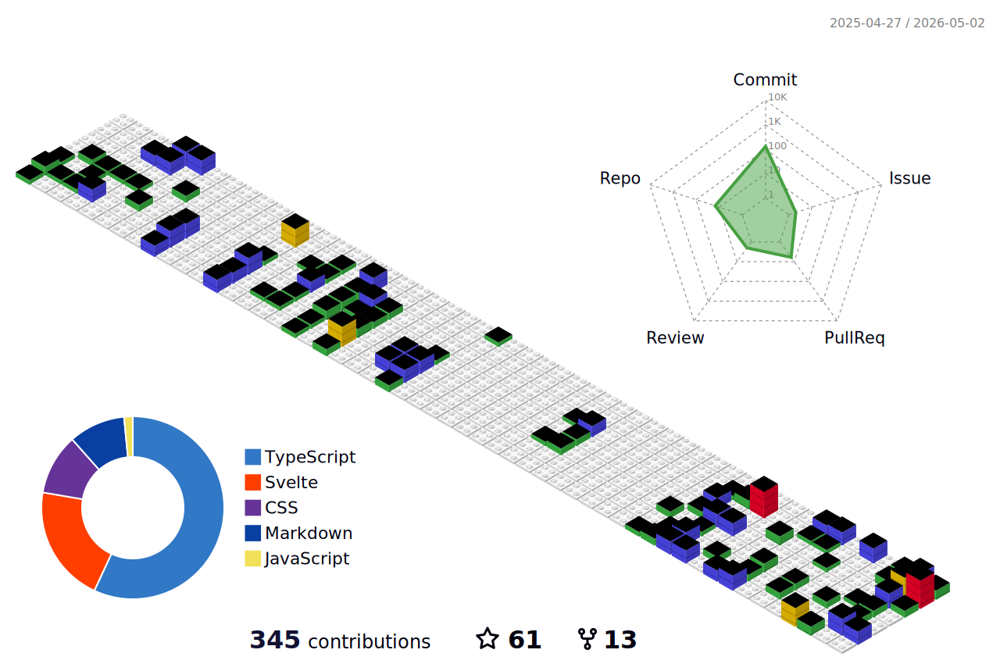

<!----------------------------------------------------------------ABOUT ME ----------------------------------------------------->


<h3 align="left">Connect with me:</h3>
<p align="left">
<a href="https://twitter.com/__gurii__" target="blank"></a>
<a href="https://linkedin.com/in/gurjeet-singh-virdee-25a476199/" target="blank"></a>
<a href="https://instagram.com/__.guri._._" target="blank"></a>
<a href="https://hashnode.com/@gurjeetsingh" target="blank"></a>
</p>
 
<div align="center">
    
</div>


<div>
       <ul align="left">
            <li> 🎉 Secured <strong>10th</strong> Rank Globally in <strong>GSSoC'22</strong> </li>
            <li> 🏢 Co-Founder at <a href="https://www.linkedin.com/company/medictry/">MedicTry</a>
            <li> 🔭 I’m currently working on <a href="https://github.com/gurjeetsinghvirdee/CaptureHub">CaptureHub</a></li>
            <li> 🌱 I’m currently learning <strong>Next JS, System Design</strong> </li>
            <li> 💬 Ask me about <strong>OpenSource</strong> </li>
            <li> 📫 How to reach me <strong><a href="mailto:gurjeetsinghvirdee@gmail.com?subject=Hello&body=Say%20Hi">gurjeetsinghvirdee@gmail.com</a></strong> </li> 
            <li> 📄 Know about my experiences <a href="https://drive.google.com/drive/u/0/folders/1wJQ3wMICqepBz3HoFzZcac2d7LlFdrrG">Resume</a></li> 
       </ul>  
</div>

<!--------------------------- Lanyard Profile--------------------------------->

<div align="center">        
    <a href="https://discord.com/users/916597112882495510"></a>
</div>

        
<!------------------------------------------TESTIMONIALS----------------------------------------------->
        
## ✨ Testimonials
        
<table>
  <tr>
    <th>Author</th>
    <th>Description</th>
  </tr>
  <tr>
    <td>Ishika Goyal</td>
    <td>Gurjeet Singh Virdee is inspiring , good mentor,  adviser and understanding friend. He continuously helping me in learning the open source contribution. I truly appreciate everything he have done for me so far and hope to continue learning from him.</td>
  </tr>
  <tr>
    <td>Utkarsh Saxena</td>
    <td>I have worked with Gurjeet on a project and he has been very kind to me. Since I am from the Android domain he explained the web concepts to me in an easy way. He is also the collaborator of my Two Repos : Leetcode Grind and Eazy Android and is always kind to the new contributors and helps them to do their best. Looking forward to working with him more and enhancing this journey of Tech and Open Source.</td>
  </tr>
</table>


<!-------------------------------------------------WAKA TIME---------------------------------------------------->

## 📊 Weekly Development Breakdown
  
<!--START_SECTION:waka-->

```txt
From: 27 July 2021 - To: 20 December 2023

Total Time: 361 hrs 56 mins

JavaScript       142 hrs 34 mins ██████████░░░░░░░░░░░░░░░   39.39 %
Markdown         63 hrs 41 mins  ████▒░░░░░░░░░░░░░░░░░░░░   17.60 %
HTML             50 hrs 55 mins  ███▓░░░░░░░░░░░░░░░░░░░░░   14.07 %
CSS              43 hrs 56 mins  ███░░░░░░░░░░░░░░░░░░░░░░   12.14 %
JSON             27 hrs 42 mins  ██░░░░░░░░░░░░░░░░░░░░░░░   07.66 %
```

<!--END_SECTION:waka--> 

<!---------------------------------Frameworks, Languages & Other Tools ------------------------------------->        
        
## ⚛️ Frameworks, Languages & Other Tools        

<p align="left"> <a href="https://appwrite.io" target="_blank" rel="noreferrer">  </a> <a href="https://babeljs.io/" target="_blank" rel="noreferrer">  </a> <a href="https://www.blender.org/" target="_blank" rel="noreferrer">  </a> <a href="https://getbootstrap.com" target="_blank" rel="noreferrer">  </a> <a href="https://www.w3schools.com/css/" target="_blank" rel="noreferrer">  </a> <a href="https://expressjs.com" target="_blank" rel="noreferrer">  </a> <a href="https://www.figma.com/" target="_blank" rel="noreferrer">  </a> <a href="https://firebase.google.com/" target="_blank" rel="noreferrer">  </a> <a href="https://www.framer.com/" target="_blank" rel="noreferrer">  </a> <a href="https://git-scm.com/" target="_blank" rel="noreferrer">  </a> <a href="https://heroku.com" target="_blank" rel="noreferrer">  </a> <a href="https://www.w3.org/html/" target="_blank" rel="noreferrer">  </a> <a href="https://developer.mozilla.org/en-US/docs/Web/JavaScript" target="_blank" rel="noreferrer">  </a> <a href="https://jekyllrb.com/" target="_blank" rel="noreferrer">  </a> <a href="https://www.mongodb.com/" target="_blank" rel="noreferrer">  </a> <a href="https://www.mysql.com/" target="_blank" rel="noreferrer">  </a> <a href="https://nextjs.org/" target="_blank" rel="noreferrer">  </a> <a href="https://nodejs.org" target="_blank" rel="noreferrer">  </a> <a href="https://postman.com" target="_blank" rel="noreferrer">  </a> <a href="https://reactjs.org/" target="_blank" rel="noreferrer">  </a> <a href="https://redux.js.org" target="_blank" rel="noreferrer">  </a> <a href="https://sass-lang.com" target="_blank" rel="noreferrer">  </a> <a href="https://scikit-learn.org/" target="_blank" rel="noreferrer">  </a> <a href="https://tailwindcss.com/" target="_blank" rel="noreferrer">  </a> <a href="https://www.typescriptlang.org/" target="_blank" rel="noreferrer">  </a> <a href="https://webpack.js.org" target="_blank" rel="noreferrer">  </a> <a href="https://www.adobe.com/products/xd.html" target="_blank" rel="noreferrer">  </a> </p> 

<!---------------------- OPEN SOURCE CONTRIBUTIONS ---------------------->
        
<details>
    <summary><h3> 👨‍💻 OPEN SOURCE CONTRIBUTIONS</h3></summary>  
    
|S.No.|Open Source Program |Duration| Contribution |Role|Rewards|
|---------|--------|-------|-------|----|-----|    
| 1. | GirlScript Summer Of Code 2022 | 1st Mar - 31st May 2022 | [Click Here](https://docs.google.com/document/d/15t_iThcyiNgIuAUmTJ9Utjy1ccxwTGZXy_0n8VYsHLE/edit?usp=sharing) | Contributor | [Link](https://drive.google.com/drive/folders/1gYYFepBLm09uATAZ9_Nh34opop_0nfCi?usp=sharing) |    
| 2. | GirlScript Summer Of Code 2022 | 1st Mar - 31st May 2022 | [Bundli-Frontend](https://github.com/Ayush7614/Bundli-Frontend) & [WebDev-ProjectKart](https://github.com/khushi-purwar/WebDev-ProjectKart) | Mentor | [Link](https://drive.google.com/drive/folders/1d0gDnPh8gR8qU61g-fWLEhahhshR8PXh?usp=sharing) |
| 3. | GirlScript Summer Of Code 2022 | 1st Mar - 31st July 2022 | Discord Moderator, Managing participants <br> activity through out the program. | Technical Team | T-Shirt [Link](https://drive.google.com/drive/folders/1B2jDXyXA-L-XXypvaNzrpXRTVY7GW-04?usp=sharing) |
| 4. | Hack Club RAIT | 1st July - 30st September 2022 | [Click Here](https://docs.google.com/document/d/1_ZutQmDbGkuFsbypF2oX_jbmFMf7OV-X4kr8xVs5J0w) | Contributor | [Link](https://drive.google.com/file/d/1Km6kXQU3NWr8OkWnaHB7-vLfEjhffplE/view?usp=sharing) |
| 5. | Hacktoberfest | 1st October - 31st October 2022 | [Click Here](https://docs.google.com/document/d/1mv27yGR7-SsIDOinqsYDnFutXHG49awhzvZYaEna3rM) | Contributor | T-Shirt & Stickers | 
| 6. | HyperEdge WOB'23 | 1st Feb - 1st May | Discord Moderator, Managing Leaderboard | Managing Team | - |
| 7. | GirlScript Summer Of Code 2023 | 6th May - 03 July | Jarvis - Decentralised Expense Tracker, GameZone | Mentor | - |
| 8. | GirlScript Summer Of Code 2023 | 29 May  - 5 September 2023 | Managing the activity of PA, Mentors & Contributors throughout the program | Discord Mod | - |
    
</details>

<!------------------------------------------------------------ GITHUB STATS ------------------------------------------------------------------------>
        
## 💫 Github Stats

<table>    
<tr>
  <td align="center">
    
  </td>
  <td align="center">
    
  </td>
</tr>
</table>

<div align="center">
     
</div>

<table>    
<tr>
  <td align="center">
    
  </td>
  <td align="center">
     
  </td>
</tr>
</table>

<div align="center">
  
</div>
        
### ⚡ Recent Activity     
        
<!--START_SECTION:activity-->  
`[12/16 08:11]`  Made `1` commit in [gurjeetsinghvirdee/gurjeetsinghvirdee](https://github.com/gurjeetsinghvirdee/gurjeetsinghvirdee)  
`[12/09 13:34]`  Made `5` commits in [gurjeetsinghvirdee/Badges4-README.md-Profile](https://github.com/gurjeetsinghvirdee/Badges4-README.md-Profile)  
`[12/09 12:56]`  Opened PR [`#609`](https://github.com//alexandresanlim/Badges4-README.md-Profile/pull/609 'Multiple badges added as per requested') in [alexandresanlim/Badges4-README.md-Profile](https://github.com/alexandresanlim/Badges4-README.md-Profile)  
`[12/09 12:46]`  Made `49` commits in [gurjeetsinghvirdee/Badges4-README.md-Profile](https://github.com/gurjeetsinghvirdee/Badges4-README.md-Profile)  
`[12/08 19:35]`  Made `2` commits in [EthPledge/eth-fund](https://github.com/EthPledge/eth-fund)  

<details><summary><b> ⚙️ Show Older Activity</b></summary>

`[12/08 19:35]`  Merged PR [`#6`](https://github.com//EthPledge/eth-fund/pull/6 'Bump vite from 4.1.1 to 4.5.1 in /client/vite') in [EthPledge/eth-fund](https://github.com/EthPledge/eth-fund)  
`[12/08 19:29]`  Made `2` commits in [EthPledge/eth-fund](https://github.com/EthPledge/eth-fund)  
`[12/08 19:29]`  Merged PR [`#5`](https://github.com//EthPledge/eth-fund/pull/5 'Bump @babel/traverse from 7.22.20 to 7.23.5 in /client') in [EthPledge/eth-fund](https://github.com/EthPledge/eth-fund)  
`[12/08 19:26]`  Made `2` commits in [EthPledge/eth-fund](https://github.com/EthPledge/eth-fund)  
`[12/08 19:26]`  Merged PR [`#3`](https://github.com//EthPledge/eth-fund/pull/3 'Bump browserify-sign from 4.2.1 to 4.2.2 in /client') in [EthPledge/eth-fund](https://github.com/EthPledge/eth-fund)  
`[12/08 19:26]`  Reviewed [`#3`](https://github.com//EthPledge/eth-fund/pull/3 'Bump browserify-sign from 4.2.1 to 4.2.2 in /client') in [EthPledge/eth-fund](https://github.com/EthPledge/eth-fund)  
`[12/08 19:16]`  Made `2` commits in [EthPledge/eth-fund](https://github.com/EthPledge/eth-fund)  
`[12/08 19:16]`  Merged PR [`#4`](https://github.com//EthPledge/eth-fund/pull/4 'Bump crypto-js, @thirdweb-dev/react and @thirdweb-dev/sdk in /client') in [EthPledge/eth-fund](https://github.com/EthPledge/eth-fund)  
`[12/08 19:16]`  Reviewed [`#4`](https://github.com//EthPledge/eth-fund/pull/4 'Bump crypto-js, @thirdweb-dev/react and @thirdweb-dev/sdk in /client') in [EthPledge/eth-fund](https://github.com/EthPledge/eth-fund)  
`[12/07 11:03]`  Starred [lusaxweb/vuesax-next](https://github.com/lusaxweb/vuesax-next)  
`[12/03 17:22]`  Made `4` commits in [gurjeetsinghvirdee/gurjeetsinghvirdee](https://github.com/gurjeetsinghvirdee/gurjeetsinghvirdee)  
`[12/03 14:38]`  Made `1` commit in [gurjeetsinghvirdee/CaptureHub](https://github.com/gurjeetsinghvirdee/CaptureHub)  
`[12/03 06:50]`  Starred [abi/screenshot-to-code](https://github.com/abi/screenshot-to-code)  
`[11/24 16:59]`  Starred [appwrite/appwrite](https://github.com/appwrite/appwrite)  
`[11/10 15:29]`  Made `13` commits in [gurjeetsinghvirdee/CaptureHub](https://github.com/gurjeetsinghvirdee/CaptureHub)  
`[11/07 08:35]`  Created branch [`master`](https://github.com/gurjeetsinghvirdee/CaptureHub/tree/master) in [gurjeetsinghvirdee/CaptureHub](https://github.com/gurjeetsinghvirdee/CaptureHub)  
`[11/07 08:28]`  Created repository [gurjeetsinghvirdee/CaptureHub](https://github.com/gurjeetsinghvirdee/CaptureHub)  
`[10/28 23:27]`  Starred [responsively-org/responsively-app](https://github.com/responsively-org/responsively-app)  
`[10/28 23:21]`  Made `2725` commits in [gurjeetsinghvirdee/LinkFree](https://github.com/gurjeetsinghvirdee/LinkFree)  
`[10/25 21:08]`  Made `1` commit in [gurjeetsinghvirdee/gurjeetsinghvirdee](https://github.com/gurjeetsinghvirdee/gurjeetsinghvirdee)  
`[10/25 20:55]`  Opened PR [`#2`](https://github.com//EthPledge/eth-fund/pull/2 'Update Readme.md') in [EthPledge/eth-fund](https://github.com/EthPledge/eth-fund)  
`[10/25 20:55]`  Made `1` commit in [EthPledge/eth-fund](https://github.com/EthPledge/eth-fund)  
`[10/25 20:52]`  Created branch [`readme`](https://github.com/EthPledge/eth-fund/tree/readme) in [EthPledge/eth-fund](https://github.com/EthPledge/eth-fund)  
`[10/23 19:32]`  Made `2` commits in [gurjeetsinghvirdee/gssoc-website-new](https://github.com/gurjeetsinghvirdee/gssoc-website-new)  
`[10/23 19:31]`  Merged PR [`#3`](https://github.com//gurjeetsinghvirdee/gssoc-website-new/pull/3 '[ImgBot] Optimize images') in [gurjeetsinghvirdee/gssoc-website-new](https://github.com/gurjeetsinghvirdee/gssoc-website-new)  
`[10/23 19:31]`  Made `4` commits in [gurjeetsinghvirdee/gssoc-website-new](https://github.com/gurjeetsinghvirdee/gssoc-website-new)  
`[10/21 19:32]`  Opened PR [`#1`](https://github.com//EthPledge/eth-fund/pull/1 'Create _redirects') in [EthPledge/eth-fund](https://github.com/EthPledge/eth-fund)  
`[10/21 19:29]`  Made `1` commit in [EthPledge/eth-fund](https://github.com/EthPledge/eth-fund)  
`[10/21 19:29]`  Created branch [`test`](https://github.com/EthPledge/eth-fund/tree/test) in [EthPledge/eth-fund](https://github.com/EthPledge/eth-fund)  
`[10/21 19:18]`  Made `2` commits in [gurjeetsinghvirdee/portfolio](https://github.com/gurjeetsinghvirdee/portfolio)  
`[10/21 19:18]`  Merged PR [`#1`](https://github.com//gurjeetsinghvirdee/portfolio/pull/1 'Bump @babel/traverse from 7.20.13 to 7.23.2 in /backend_sanity') in [gurjeetsinghvirdee/portfolio](https://github.com/gurjeetsinghvirdee/portfolio)  
`[10/21 17:04]`  Starred [chhavi48/threejs_Drei](https://github.com/chhavi48/threejs_Drei)  
`[10/17 19:05]`  Made `4` commits in [gurjeetsinghvirdee/gurjeetsinghvirdee](https://github.com/gurjeetsinghvirdee/gurjeetsinghvirdee)  
`[10/16 20:19]`  Made `4` commits in [gurjeetsinghvirdee/awesome-chrome-extensions](https://github.com/gurjeetsinghvirdee/awesome-chrome-extensions)  
`[10/16 20:12]`  Opened PR [`#19`](https://github.com//Miniato-Office/awesome-chrome-extensions/pull/19 'Add - MetaMask ') in [Miniato-Office/awesome-chrome-extensions](https://github.com/Miniato-Office/awesome-chrome-extensions)  
`[10/16 20:08]`  Made `1` commit in [gurjeetsinghvirdee/awesome-chrome-extensions](https://github.com/gurjeetsinghvirdee/awesome-chrome-extensions)  
`[10/16 20:06]`  Created branch [`metamask`](https://github.com/gurjeetsinghvirdee/awesome-chrome-extensions/tree/metamask) in [gurjeetsinghvirdee/awesome-chrome-extensions](https://github.com/gurjeetsinghvirdee/awesome-chrome-extensions)  
`[10/16 20:06]`  Made `4` commits in [gurjeetsinghvirdee/awesome-chrome-extensions](https://github.com/gurjeetsinghvirdee/awesome-chrome-extensions)  
`[10/16 20:04]`  Opened issue [`#18`](https://github.com//Miniato-Office/awesome-chrome-extensions/issues/18 'Add - MetaMask') in [Miniato-Office/awesome-chrome-extensions](https://github.com/Miniato-Office/awesome-chrome-extensions)  
`[10/16 19:55]`  Commented on [`#17`](https://github.com//Miniato-Office/awesome-chrome-extensions/issues/17 'Add - WA Bulk Messaage Sender') in [Miniato-Office/awesome-chrome-extensions](https://github.com/Miniato-Office/awesome-chrome-extensions)  
`[10/16 19:53]`  Made `1` commit in [gurjeetsinghvirdee/awesome-chrome-extensions](https://github.com/gurjeetsinghvirdee/awesome-chrome-extensions)  
`[10/16 08:00]`  Opened PR [`#17`](https://github.com//Miniato-Office/awesome-chrome-extensions/pull/17 'Add - WA Bulk Messaage Sender') in [Miniato-Office/awesome-chrome-extensions](https://github.com/Miniato-Office/awesome-chrome-extensions)  
`[10/15 23:37]`  Made `1` commit in [gurjeetsinghvirdee/awesome-chrome-extensions](https://github.com/gurjeetsinghvirdee/awesome-chrome-extensions)  
`[10/15 23:35]`  Created branch [`wa_bulk_msg`](https://github.com/gurjeetsinghvirdee/awesome-chrome-extensions/tree/wa_bulk_msg) in [gurjeetsinghvirdee/awesome-chrome-extensions](https://github.com/gurjeetsinghvirdee/awesome-chrome-extensions)  
`[10/15 23:25]`  Forked [Miniato-Office/awesome-chrome-extensions](https://github.com/Miniato-Office/awesome-chrome-extensions) to [gurjeetsinghvirdee/awesome-chrome-extensions](https://github.com/gurjeetsinghvirdee/awesome-chrome-extensions)  
`[10/15 23:24]`  Opened issue [`#16`](https://github.com//Miniato-Office/awesome-chrome-extensions/issues/16 'Add Number System Converter') in [Miniato-Office/awesome-chrome-extensions](https://github.com/Miniato-Office/awesome-chrome-extensions)  
`[10/14 23:05]`  Made `6` commits in [gurjeetsinghvirdee/eth-fund](https://github.com/gurjeetsinghvirdee/eth-fund)  
`[10/08 09:03]`  Made `1` commit in [gurjeetsinghvirdee/crypto-tracker](https://github.com/gurjeetsinghvirdee/crypto-tracker)  
`[10/08 08:39]`  Made `2` commits in [gurjeetsinghvirdee/eth-fund](https://github.com/gurjeetsinghvirdee/eth-fund)  
`[10/08 08:39]`  Merged PR [`#3`](https://github.com//gurjeetsinghvirdee/eth-fund/pull/3 '[ImgBot] Optimize images') in [gurjeetsinghvirdee/eth-fund](https://github.com/gurjeetsinghvirdee/eth-fund)  
`[10/07 21:56]`  Made `3` commits in [gurjeetsinghvirdee/crypto-tracker](https://github.com/gurjeetsinghvirdee/crypto-tracker)  
`[10/07 20:52]`  Created branch [`master`](https://github.com/gurjeetsinghvirdee/crypto-tracker/tree/master) in [gurjeetsinghvirdee/crypto-tracker](https://github.com/gurjeetsinghvirdee/crypto-tracker)  
`[10/07 20:43]`  Created repository [gurjeetsinghvirdee/cryptocurrency-tracker](https://github.com/gurjeetsinghvirdee/cryptocurrency-tracker)  
`[10/06 17:27]`  Commented on [`#51`](https://github.com//adrianhajdin/project_crowdfunding/issues/51 '[BugFix - getDonators and donateToCampaign give errors #40]') in [adrianhajdin/project_crowdfunding](https://github.com/adrianhajdin/project_crowdfunding)  
`[10/06 17:06]`  Commented on [`#51`](https://github.com//adrianhajdin/project_crowdfunding/issues/51 '[BugFix - getDonators and donateToCampaign give errors #40]') in [adrianhajdin/project_crowdfunding](https://github.com/adrianhajdin/project_crowdfunding)  
`[10/06 16:34]`  Made `3` commits in [gurjeetsinghvirdee/eth-fund](https://github.com/gurjeetsinghvirdee/eth-fund)  
`[10/06 16:04]`  Commented on [`#51`](https://github.com//adrianhajdin/project_crowdfunding/issues/51 '[BugFix - getDonators and donateToCampaign give errors #40]') in [adrianhajdin/project_crowdfunding](https://github.com/adrianhajdin/project_crowdfunding)  
`[10/05 23:17]`  Made `2` commits in [gurjeetsinghvirdee/eth-fund](https://github.com/gurjeetsinghvirdee/eth-fund)  
`[10/05 22:08]`  Commented on [`#51`](https://github.com//adrianhajdin/project_crowdfunding/issues/51 '[BugFix - getDonators and donateToCampaign give errors #40]') in [adrianhajdin/project_crowdfunding](https://github.com/adrianhajdin/project_crowdfunding)  
`[10/05 21:37]`  Made `4` commits in [gurjeetsinghvirdee/eth-fund](https://github.com/gurjeetsinghvirdee/eth-fund)  
`[10/04 21:37]`  Commented on [`#132`](https://github.com//RedKatz/SocialMediaHackingToolkit/issues/132 'Crashing after wordlist') in [RedKatz/SocialMediaHackingToolkit](https://github.com/RedKatz/SocialMediaHackingToolkit)  
`[10/04 21:05]`  Made `4` commits in [gurjeetsinghvirdee/eth-fund](https://github.com/gurjeetsinghvirdee/eth-fund)  
`[10/03 21:12]`  Made `61` commits in [gurjeetsinghvirdee/Badges4-README.md-Profile](https://github.com/gurjeetsinghvirdee/Badges4-README.md-Profile)  
`[10/03 21:09]`  Made `2` commits in [gurjeetsinghvirdee/gurjeetsinghvirdee](https://github.com/gurjeetsinghvirdee/gurjeetsinghvirdee)  
`[10/03 20:38]`  Made `1` commit in [gurjeetsinghvirdee/eth-fund](https://github.com/gurjeetsinghvirdee/eth-fund)  
`[10/03 17:04]`  Made `7` commits in [gurjeetsinghvirdee/React-Aura](https://github.com/gurjeetsinghvirdee/React-Aura)  
`[10/03 08:51]`  Commented on [`#13`](https://github.com//pooranjoyb/React-Aura/issues/13 'Sidebar Component created') in [pooranjoyb/React-Aura](https://github.com/pooranjoyb/React-Aura)  
`[10/03 07:55]`  Commented on [`#13`](https://github.com//pooranjoyb/React-Aura/issues/13 'Sidebar Component created') in [pooranjoyb/React-Aura](https://github.com/pooranjoyb/React-Aura)  
`[10/03 07:55]`  Made `1` commit in [gurjeetsinghvirdee/React-Aura](https://github.com/gurjeetsinghvirdee/React-Aura)  
`[10/03 07:47]`  Reviewed [`#13`](https://github.com//pooranjoyb/React-Aura/pull/13 'Sidebar Component created') in [pooranjoyb/React-Aura](https://github.com/pooranjoyb/React-Aura)  
`[10/03 07:46]`  Made `1` commit in [gurjeetsinghvirdee/React-Aura](https://github.com/gurjeetsinghvirdee/React-Aura)  
`[10/03 05:51]`  Reviewed [`#13`](https://github.com//pooranjoyb/React-Aura/pull/13 'Sidebar Component created') in [pooranjoyb/React-Aura](https://github.com/pooranjoyb/React-Aura)  
`[10/03 05:51]`  Made `1` commit in [gurjeetsinghvirdee/React-Aura](https://github.com/gurjeetsinghvirdee/React-Aura)  
`[10/03 05:49]`  Reviewed [`#13`](https://github.com//pooranjoyb/React-Aura/pull/13 'Sidebar Component created') in [pooranjoyb/React-Aura](https://github.com/pooranjoyb/React-Aura)  
`[10/03 05:45]`  Reviewed [`#13`](https://github.com//pooranjoyb/React-Aura/pull/13 'Sidebar Component created') in [pooranjoyb/React-Aura](https://github.com/pooranjoyb/React-Aura)  
`[10/03 05:32]`  Opened PR [`#13`](https://github.com//pooranjoyb/React-Aura/pull/13 'Sidebar Component created') in [pooranjoyb/React-Aura](https://github.com/pooranjoyb/React-Aura)  
`[10/03 05:29]`  Made `2` commits in [gurjeetsinghvirdee/React-Aura](https://github.com/gurjeetsinghvirdee/React-Aura)  
`[10/02 22:52]`  Commented on [`#12`](https://github.com//pooranjoyb/React-Aura/issues/12 'Want to create a Cards Component Page') in [pooranjoyb/React-Aura](https://github.com/pooranjoyb/React-Aura)  
`[10/02 22:43]`  Created branch [`gurjeetsinghvirdee`](https://github.com/gurjeetsinghvirdee/React-Aura/tree/gurjeetsinghvirdee) in [gurjeetsinghvirdee/React-Aura](https://github.com/gurjeetsinghvirdee/React-Aura)  
`[10/02 18:51]`  Commented on [`#12`](https://github.com//pooranjoyb/React-Aura/issues/12 'Want to create a Cards Component Page') in [pooranjoyb/React-Aura](https://github.com/pooranjoyb/React-Aura)  
`[10/02 18:46]`  Made `1` commit in [gurjeetsinghvirdee/React-Aura](https://github.com/gurjeetsinghvirdee/React-Aura)  
`[10/02 18:44]`  Opened issue [`#12`](https://github.com//pooranjoyb/React-Aura/issues/12 'Want to create a Cards Component Page') in [pooranjoyb/React-Aura](https://github.com/pooranjoyb/React-Aura)  
`[10/02 17:39]`  Forked [pooranjoyb/React-Aura](https://github.com/pooranjoyb/React-Aura) to [gurjeetsinghvirdee/React-Aura](https://github.com/gurjeetsinghvirdee/React-Aura)  
`[10/02 17:39]`  Opened issue [`#11`](https://github.com//pooranjoyb/React-Aura/issues/11 'Want to add custom Flip Card ') in [pooranjoyb/React-Aura](https://github.com/pooranjoyb/React-Aura)  
`[09/29 00:09]`  Made `3` commits in [gurjeetsinghvirdee/eth-fund](https://github.com/gurjeetsinghvirdee/eth-fund)  
`[09/28 23:38]`  Commented on [`#2`](https://github.com//gurjeetsinghvirdee/eth-fund/issues/2 'double check that the address and chainId are correct.') in [gurjeetsinghvirdee/eth-fund](https://github.com/gurjeetsinghvirdee/eth-fund)  
`[09/28 23:19]`  Opened issue [`#2`](https://github.com//gurjeetsinghvirdee/eth-fund/issues/2 'double check that the address and chainId are correct.') in [gurjeetsinghvirdee/eth-fund](https://github.com/gurjeetsinghvirdee/eth-fund)  
`[09/28 23:15]`  Commented on [`#1`](https://github.com//gurjeetsinghvirdee/eth-fund/issues/1 'function createCampaign ') in [gurjeetsinghvirdee/eth-fund](https://github.com/gurjeetsinghvirdee/eth-fund)  
`[09/28 23:12]`  Opened issue [`#1`](https://github.com//gurjeetsinghvirdee/eth-fund/issues/1 'function createCampaign ') in [gurjeetsinghvirdee/eth-fund](https://github.com/gurjeetsinghvirdee/eth-fund)  
`[09/28 23:08]`  Made `3` commits in [gurjeetsinghvirdee/eth-fund](https://github.com/gurjeetsinghvirdee/eth-fund)  
`[09/28 08:17]`  Starred [leonardomso/33-js-concepts](https://github.com/leonardomso/33-js-concepts)  
`[09/28 08:13]`  Starred [TheAlgorithms/JavaScript](https://github.com/TheAlgorithms/JavaScript)  
`[09/26 18:46]`  Made `5` commits in [gurjeetsinghvirdee/web3-crowdfunding](https://github.com/gurjeetsinghvirdee/web3-crowdfunding)  
`[09/23 18:32]`  Starred [utkarsh006/WeTweets](https://github.com/utkarsh006/WeTweets)  
`[09/22 21:44]`  Made `2` commits in [gurjeetsinghvirdee/web3-crowdfunding](https://github.com/gurjeetsinghvirdee/web3-crowdfunding)  
`[09/22 17:26]`  Made `2` commits in [girlscript/gssoc-website-new](https://github.com/girlscript/gssoc-website-new)  

</details>
<!--END_SECTION:activity-->

<!--------------------------------------------- 3D Contribution Graph -------------------------------------------->




       
<!---------------------------------------------- Some More Stats ------------------------------------------------->       
       
<details>
  <summary> <b> ❤️ Github Followers </b> </summary>
    
</details>   

<details>
  <summary> <b> 💻 Github Terminal </b> </summary>
    
</details>

<details>
  <summary> <b> 📆 Github Contribution Calendar </b></summary>
    
</details>


