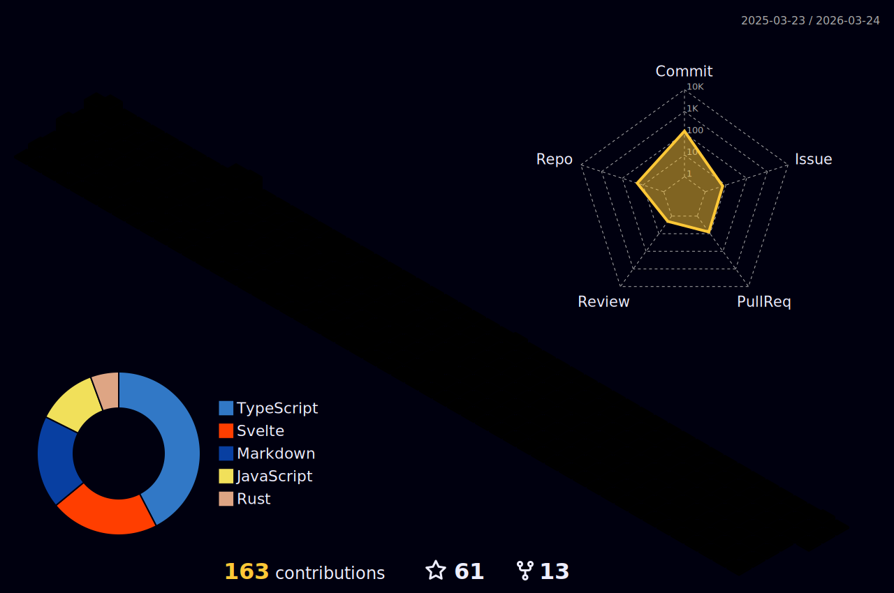

## Hey Everyone👋

[](https://holopin.io/@guri)

<!-- About Me -->

I'm a MERN Stack Developer and UI Designer, Currently in Second Year Studying BCA, Co-Founder at [Medictry](https://www.linkedin.com/company/89489745/admin/), Collabing with [Aviyel](https://aviyel.com/discussions) as Content Creator, Former Technical Team Member & Mentored 150+ Contributors on [GSSoC'22](https://gssoc.girlscript.tech/) and also A Technical Content Writer at [GeeksforGeeks](https://www.geeksforgeeks.org/)  

<p align="center">
    <a href="https://gurjeet.hashnode.dev/" target="_blank">
    
    <a href="https://twitter.com/__gurii__" target="_blank">   
    
    <a href="https://www.linkedin.com/in/gurjeet-singh-virdee-25a476199/" target="_blank">
    
    <a href="https://discordapp.com/users/916597112882495510" target="_blank">
    
    <a href = "mailto: gurjeetsinghvirdee@gmail.com" target="_blank"></a>
 </p>
 
<div align="center"> 

</div>


  
<ul align="left">
    
  <li> 🏢 Co-Founder at <a href="https://www.linkedin.com/company/medictry/">Medictry</a>
  <li> 🧑‍💻 <strong>8</strong> PRs Merged at Hactoberfest'22 </li>
  <li> 💻 Contributor & Project Admin at HSOC'22 </li>
  <li> 🎉 Secured <strong>10th</strong> Rank Globally in GSSoC'22 </li>
  <li> 🏫 Currently learning DSA </li>
  <li> 🤝 Collaborator at <a href="https://github.com/Rayman-Sodhi/Clone-IT"> Clone-IT </a> & <a href="https://github.com/utkarsh006/Eazy-Android"> Eazy-Android </a>
  </li>
  <li> 💬 Ask me about Anything </li>
  <li> 📕 Read My Articles at 
    <a href="https://auth.geeksforgeeks.org/user/gurjeetsinghvirdee/articles" target="_blank">@GeeksforGeeks</a>
  </li>
</ul>  

<!------------------------------------------- Spotify Profile --------------------------------------------->

<div align="center">
    <a href="https://spotify-github-profile.vercel.app/api/view.svg?uid=31xcftnaufneyotbwgeuezrzheky&redirect=true"></a>
</div>    

## 📊 Weekly Developement Breakdown
  
<!--START_SECTION:waka-->

```text
From: 27 July 2021 - To: 02 January 2023

Total Time: 195 hrs 53 mins

JavaScript       54 hrs 39 mins  ███████░░░░░░░░░░░░░░░░░░   27.91 %
Markdown         50 hrs 39 mins  ██████▒░░░░░░░░░░░░░░░░░░   25.86 %
HTML             38 hrs 9 mins   █████░░░░░░░░░░░░░░░░░░░░   19.48 %
CSS              27 hrs 18 mins  ███▒░░░░░░░░░░░░░░░░░░░░░   13.94 %
JSON             8 hrs 56 mins   █░░░░░░░░░░░░░░░░░░░░░░░░   04.56 %
TypeScript       3 hrs 7 mins    ▒░░░░░░░░░░░░░░░░░░░░░░░░   01.59 %
```

<!--END_SECTION:waka--> 

<!----------------------------------GIT ARTWORK------------------------------------->        
        
<p align="center">
    
</p> 
        
<details>
   <summary> <h3> ⚛️ Frameworks, Languages & Other Tools </h3> </summary> <br>
     <p align="center">
         
        
        
        
        
        
        
        
        
        
        
        
          
        
        
        
        
        
        
        
        
        
        
        
        
        
     </p>
</details>
        
<!---------------------- OPEN SOUCRE CONTRIBUTIONS ---------------------->
        
<details>
    <summary><h3> 👨‍💻 OPEN SOURCE CONTRIBUTIONS</h3></summary>  
    
|S.No.|Open Source Program |Duration| Contribution |Role|Rewards|
|---------|--------|-------|-------|----|-----|    
| 1. | GirlScript Summer Of Code | 1st Mar - 31st May 2022 | [Click Here](https://docs.google.com/document/d/15t_iThcyiNgIuAUmTJ9Utjy1ccxwTGZXy_0n8VYsHLE/edit?usp=sharing) | Contributor | [Link](https://drive.google.com/drive/folders/1gYYFepBLm09uATAZ9_Nh34opop_0nfCi?usp=sharing) |    
| 2. | GirlScript Summer Of Code | 1st Mar - 31st May 2022 | [Bundli-Frontend](https://github.com/Ayush7614/Bundli-Frontend) & [WebDev-ProjectKart](https://github.com/khushi-purwar/WebDev-ProjectKart) | Mentor | [Link](https://drive.google.com/drive/folders/1d0gDnPh8gR8qU61g-fWLEhahhshR8PXh?usp=sharing) |
| 3. | GirlScript Summer Of Code | 1st Mar - 31st July 2022 | Discord Moderator | Technical Team | T-Shirt [Link](https://drive.google.com/drive/folders/1B2jDXyXA-L-XXypvaNzrpXRTVY7GW-04?usp=sharing) |
| 4. | Hack Club RAIT | 1st July - 30st September 2022 | [Click Here](https://docs.google.com/document/d/1_ZutQmDbGkuFsbypF2oX_jbmFMf7OV-X4kr8xVs5J0w) | Contributor | [Link](https://drive.google.com/file/d/1Km6kXQU3NWr8OkWnaHB7-vLfEjhffplE/view?usp=sharing) |
| 5. | Hacktoberfest | 1st October - 31st October 2022 | [Click Here](https://docs.google.com/document/d/1mv27yGR7-SsIDOinqsYDnFutXHG49awhzvZYaEna3rM) | Contributor | T-Shirt & Stickers | 
    
</details>
        
## 💫 Github Stats
        
<div align="center">
 <a href="https://github-readme-streak-stats.herokuapp.com/?user=gurjeetsinghvirdee&theme=synthwave" target="_blank">
    &nbsp;
 </a>
    
 <a href="https://github-readme-stats.vercel.app/api?username=gurjeetsinghvirdee&show_icons=true&theme=synthwave&include_all_commits=true" target="_blank">
  
 </a>
</div>      
  


<div align="center">
    <a href="https://github-profile-trophy.vercel.app/?username=gurjeetsinghvirdee&theme=radical" target="_blank">
        
    </a>
</diV>


        
<div align="center">
   <a href="https://github-readme-stats.vercel.app/api/top-langs/?username=gurjeetsinghvirdee&layout=compact&theme=synthwave&langs_count=15" target="_blank">
         
   </a> 
</div>   
        
### ⚡ Recent Activity     
        
<!--START_SECTION:activity-->  
`[01/03 17:54]`  Made `1` commit in [gurjeetsinghvirdee/LinkFree](https://github.com/gurjeetsinghvirdee/LinkFree)  
`[01/03 17:54]`  Deleted `imgbot` from [gurjeetsinghvirdee/LinkFree](https://github.com/gurjeetsinghvirdee/LinkFree)  
`[01/03 17:54]`  Closed PR [`#2`](https://github.com//gurjeetsinghvirdee/LinkFree/pull/2 '[ImgBot] Optimize images') in [gurjeetsinghvirdee/LinkFree](https://github.com/gurjeetsinghvirdee/LinkFree)  
`[01/03 17:52]`  Made `8` commits in [gurjeetsinghvirdee/LinkFree](https://github.com/gurjeetsinghvirdee/LinkFree)  
`[01/03 17:51]`  Made `5` commits in [gurjeetsinghvirdee/Clone-IT](https://github.com/gurjeetsinghvirdee/Clone-IT)  

<details><summary><b> ⚙️ Show Older Activity</b></summary>

`[01/03 17:49]`  Reopened issue [`#711`](https://github.com//Rayman-Sodhi/Clone-IT/issues/711 'Airbnb clone related bugs') in [Rayman-Sodhi/Clone-IT](https://github.com/Rayman-Sodhi/Clone-IT)  
`[01/03 17:49]`  Commented on [`#711`](https://github.com//Rayman-Sodhi/Clone-IT/issues/711 'Airbnb clone related bugs') in [Rayman-Sodhi/Clone-IT](https://github.com/Rayman-Sodhi/Clone-IT)  
`[01/03 17:47]`  Commented on [`#711`](https://github.com//Rayman-Sodhi/Clone-IT/issues/711 'Airbnb clone related bugs') in [Rayman-Sodhi/Clone-IT](https://github.com/Rayman-Sodhi/Clone-IT)  
`[01/03 17:45]`  Made `1` commit in [Rayman-Sodhi/Clone-IT](https://github.com/Rayman-Sodhi/Clone-IT)  
`[01/03 14:17]`  Commented on [`#2620`](https://github.com//EddieHubCommunity/LinkFree/issues/2620 'Updated My Profile') in [EddieHubCommunity/LinkFree](https://github.com/EddieHubCommunity/LinkFree)  
`[01/03 13:13]`  Made `2` commits in [gurjeetsinghvirdee/EduTech](https://github.com/gurjeetsinghvirdee/EduTech)  
`[01/03 13:03]`  Closed PR [`#2619`](https://github.com//EddieHubCommunity/LinkFree/pull/2619 'Update My profile') in [EddieHubCommunity/LinkFree](https://github.com/EddieHubCommunity/LinkFree)  
`[01/03 13:03]`  Opened PR [`#2620`](https://github.com//EddieHubCommunity/LinkFree/pull/2620 'Updated My Profile') in [EddieHubCommunity/LinkFree](https://github.com/EddieHubCommunity/LinkFree)  
`[01/03 13:00]`  Opened PR [`#2619`](https://github.com//EddieHubCommunity/LinkFree/pull/2619 'Update My profile') in [EddieHubCommunity/LinkFree](https://github.com/EddieHubCommunity/LinkFree)  
`[01/03 12:58]`  Made `6` commits in [gurjeetsinghvirdee/LinkFree](https://github.com/gurjeetsinghvirdee/LinkFree)  
`[01/03 12:58]`  Created branch [`gurjeet`](https://github.com/gurjeetsinghvirdee/LinkFree/tree/gurjeet) in [gurjeetsinghvirdee/LinkFree](https://github.com/gurjeetsinghvirdee/LinkFree)  
`[01/03 12:00]`  Made `1000` commits in [gurjeetsinghvirdee/LinkFree](https://github.com/gurjeetsinghvirdee/LinkFree)  
`[01/01 16:49]`  Made `4` commits in [Rayman-Sodhi/Clone-IT](https://github.com/Rayman-Sodhi/Clone-IT)  
`[01/01 16:37]`  Commented on [`#711`](https://github.com//Rayman-Sodhi/Clone-IT/issues/711 'Airbnb clone related bugs') in [Rayman-Sodhi/Clone-IT](https://github.com/Rayman-Sodhi/Clone-IT)  
`[12/31 18:43]`  Merged PR [`#1`](https://github.com//gurjeetsinghvirdee/EduTech/pull/1 '[ImgBot] Optimize images') in [gurjeetsinghvirdee/EduTech](https://github.com/gurjeetsinghvirdee/EduTech)  
`[12/31 18:43]`  Made `2` commits in [gurjeetsinghvirdee/EduTech](https://github.com/gurjeetsinghvirdee/EduTech)  
`[12/31 18:05]`  Starred [gurjeetsinghvirdee/EduTech](https://github.com/gurjeetsinghvirdee/EduTech)  
`[12/31 18:04]`  Starred [gurjeetsinghvirdee/EduTech](https://github.com/gurjeetsinghvirdee/EduTech)  
`[12/31 18:00]`  Made `1` commit in [gurjeetsinghvirdee/gurjeetsinghvirdee](https://github.com/gurjeetsinghvirdee/gurjeetsinghvirdee)  
`[12/31 17:59]`  Made `43` commits in [gurjeetsinghvirdee/EduTech](https://github.com/gurjeetsinghvirdee/EduTech)  
`[12/23 15:22]`  Made `1` commit in [gurjeetsinghvirdee/Clone-IT](https://github.com/gurjeetsinghvirdee/Clone-IT)  
`[12/15 23:12]`  Made `22` commits in [gurjeetsinghvirdee/roadmaps](https://github.com/gurjeetsinghvirdee/roadmaps)  
`[12/10 17:37]`  Made `2` commits in [Rayman-Sodhi/Clone-IT](https://github.com/Rayman-Sodhi/Clone-IT)  
`[12/10 17:37]`  Merged PR [`#710`](https://github.com//Rayman-Sodhi/Clone-IT/pull/710 'Update README.md') in [Rayman-Sodhi/Clone-IT](https://github.com/Rayman-Sodhi/Clone-IT)  
`[12/10 17:37]`  Opened PR [`#710`](https://github.com//Rayman-Sodhi/Clone-IT/pull/710 'Update README.md') in [Rayman-Sodhi/Clone-IT](https://github.com/Rayman-Sodhi/Clone-IT)  
`[12/09 16:18]`  Made `1` commit in [gurjeetsinghvirdee/Clone-IT](https://github.com/gurjeetsinghvirdee/Clone-IT)  
`[12/09 16:05]`  Forked [Kritika30032002/Top_Secrets](https://github.com/Kritika30032002/Top_Secrets) to [gurjeetsinghvirdee/Top_Secrets](https://github.com/gurjeetsinghvirdee/Top_Secrets)  
`[12/07 18:52]`  Made `37` commits in [gurjeetsinghvirdee/EduTech](https://github.com/gurjeetsinghvirdee/EduTech)  
`[12/06 10:21]`  Made `1` commit in [gurjeetsinghvirdee/gurjeetsinghvirdee](https://github.com/gurjeetsinghvirdee/gurjeetsinghvirdee)  
`[11/24 20:00]`  Made `2` commits in [gurjeetsinghvirdee/angular](https://github.com/gurjeetsinghvirdee/angular)  
`[11/24 20:00]`  Merged PR [`#2`](https://github.com//gurjeetsinghvirdee/angular/pull/2 'Bump engine.io from 6.2.0 to 6.2.1') in [gurjeetsinghvirdee/angular](https://github.com/gurjeetsinghvirdee/angular)  
`[11/24 19:59]`  Made `2` commits in [gurjeetsinghvirdee/angular](https://github.com/gurjeetsinghvirdee/angular)  
`[11/24 19:59]`  Merged PR [`#1`](https://github.com//gurjeetsinghvirdee/angular/pull/1 'Bump loader-utils from 2.0.2 to 2.0.4') in [gurjeetsinghvirdee/angular](https://github.com/gurjeetsinghvirdee/angular)  
`[11/24 19:57]`  Made `2` commits in [gurjeetsinghvirdee/skillvalley-assesment](https://github.com/gurjeetsinghvirdee/skillvalley-assesment)  
`[11/24 19:57]`  Merged PR [`#2`](https://github.com//gurjeetsinghvirdee/skillvalley-assesment/pull/2 'Bump loader-utils and react-scripts') in [gurjeetsinghvirdee/skillvalley-assesment](https://github.com/gurjeetsinghvirdee/skillvalley-assesment)  
`[11/22 18:22]`  Made `3` commits in [utkarsh006/Eazy-Android](https://github.com/utkarsh006/Eazy-Android)  
`[11/22 18:22]`  Merged PR [`#65`](https://github.com//utkarsh006/Eazy-Android/pull/65 'Broken Link fixed') in [utkarsh006/Eazy-Android](https://github.com/utkarsh006/Eazy-Android)  
`[11/22 18:21]`  Opened PR [`#65`](https://github.com//utkarsh006/Eazy-Android/pull/65 'Broken Link fixed') in [utkarsh006/Eazy-Android](https://github.com/utkarsh006/Eazy-Android)  
`[11/22 18:16]`  Made `6` commits in [gurjeetsinghvirdee/Eazy-Android](https://github.com/gurjeetsinghvirdee/Eazy-Android)  
`[11/22 17:57]`  Opened issue [`#302`](https://github.com//WeMakeDevs/roadmaps/issues/302 'Replace the Hacker Club Hackerabad expired discord link with new link') in [WeMakeDevs/roadmaps](https://github.com/WeMakeDevs/roadmaps)  
`[11/22 17:49]`  Made `23` commits in [gurjeetsinghvirdee/roadmaps](https://github.com/gurjeetsinghvirdee/roadmaps)  
`[11/21 20:22]`  Made `5` commits in [gurjeetsinghvirdee/EduTech](https://github.com/gurjeetsinghvirdee/EduTech)  
`[11/15 15:27]`  Made `12` commits in [gurjeetsinghvirdee/udemy](https://github.com/gurjeetsinghvirdee/udemy)  
`[11/14 13:18]`  Deleted `main` from [gurjeetsinghvirdee/udemy](https://github.com/gurjeetsinghvirdee/udemy)  
`[11/14 13:16]`  Made `1` commit in [gurjeetsinghvirdee/udemy](https://github.com/gurjeetsinghvirdee/udemy)  
`[11/14 13:12]`  Created branch [`master`](https://github.com/gurjeetsinghvirdee/udemy/tree/master) in [gurjeetsinghvirdee/udemy](https://github.com/gurjeetsinghvirdee/udemy)  
`[11/14 13:04]`  Created repository [gurjeetsinghvirdee/udemy](https://github.com/gurjeetsinghvirdee/udemy)  
`[11/14 13:04]`  Created branch [`main`](https://github.com/gurjeetsinghvirdee/udemy/tree/main) in [gurjeetsinghvirdee/udemy](https://github.com/gurjeetsinghvirdee/udemy)  
`[11/10 14:27]`  Starred [khushbumaheshwarii/TinDog](https://github.com/khushbumaheshwarii/TinDog)  
`[11/08 15:31]`  Opened PR [`#1`](https://github.com//ishikagoyal02/My-Personal-Website/pull/1 'Fixed most of the things') in [ishikagoyal02/My-Personal-Website](https://github.com/ishikagoyal02/My-Personal-Website)  
`[11/08 15:25]`  Made `3` commits in [gurjeetsinghvirdee/My-Personal-Website](https://github.com/gurjeetsinghvirdee/My-Personal-Website)  
`[11/08 14:50]`  Forked [ishikagoyal02/My-Personal-Website](https://github.com/ishikagoyal02/My-Personal-Website) to [gurjeetsinghvirdee/My-Personal-Website](https://github.com/gurjeetsinghvirdee/My-Personal-Website)  
`[11/07 17:11]`  Made `2` commits in [gurjeetsinghvirdee/gurjeetsinghvirdee](https://github.com/gurjeetsinghvirdee/gurjeetsinghvirdee)  
`[11/05 15:36]`  Commented on [`#1`](https://github.com//khushbumaheshwarii/TinDog/issues/1 'Fixed padding') in [khushbumaheshwarii/TinDog](https://github.com/khushbumaheshwarii/TinDog)  
`[11/05 15:36]`  Opened PR [`#1`](https://github.com//khushbumaheshwarii/TinDog/pull/1 'Fixed padding') in [khushbumaheshwarii/TinDog](https://github.com/khushbumaheshwarii/TinDog)  
`[11/05 15:34]`  Made `2` commits in [gurjeetsinghvirdee/TinDog](https://github.com/gurjeetsinghvirdee/TinDog)  
`[11/05 15:34]`  Merged PR [`#1`](https://github.com//gurjeetsinghvirdee/TinDog/pull/1 '[ImgBot] Optimize images') in [gurjeetsinghvirdee/TinDog](https://github.com/gurjeetsinghvirdee/TinDog)  
`[11/05 15:34]`  Made `1` commit in [gurjeetsinghvirdee/TinDog](https://github.com/gurjeetsinghvirdee/TinDog)  
`[11/05 15:09]`  Forked [khushbumaheshwarii/TinDog](https://github.com/khushbumaheshwarii/TinDog) to [gurjeetsinghvirdee/TinDog](https://github.com/gurjeetsinghvirdee/TinDog)  
`[11/05 14:54]`  Made `4` commits in [gurjeetsinghvirdee/moving-car-animation](https://github.com/gurjeetsinghvirdee/moving-car-animation)  
`[11/04 18:21]`  Made `3` commits in [utkarsh006/LeetCode-Grind](https://github.com/utkarsh006/LeetCode-Grind)  
`[11/03 13:39]`  Made `1` commit in [gurjeetsinghvirdee/Eazy-Android](https://github.com/gurjeetsinghvirdee/Eazy-Android)  
`[11/02 15:50]`  Made `1` commit in [gurjeetsinghvirdee/gurjeetsinghvirdee](https://github.com/gurjeetsinghvirdee/gurjeetsinghvirdee)  
`[11/01 04:36]`  Made `1` commit in [utkarsh006/LeetCode-Grind](https://github.com/utkarsh006/LeetCode-Grind)  
`[11/01 04:33]`  Made `1` commit in [utkarsh006/Eazy-Android](https://github.com/utkarsh006/Eazy-Android)  
`[10/31 17:35]`  Made `1` commit in [khushi-purwar/WebDev-ProjectKart](https://github.com/khushi-purwar/WebDev-ProjectKart)  
`[10/30 17:16]`  Made `1` commit in [gurjeetsinghvirdee/moving-car-animation](https://github.com/gurjeetsinghvirdee/moving-car-animation)  
`[10/30 17:07]`  Opened PR [`#4`](https://github.com//ishikagoyal02/moving-car-animation/pull/4 'wheel and track adjustment') in [ishikagoyal02/moving-car-animation](https://github.com/ishikagoyal02/moving-car-animation)  
`[10/30 17:06]`  Made `8` commits in [gurjeetsinghvirdee/moving-car-animation](https://github.com/gurjeetsinghvirdee/moving-car-animation)  
`[10/30 16:25]`  Merged PR [`#1`](https://github.com//gurjeetsinghvirdee/moving-car-animation/pull/1 '[ImgBot] Optimize images') in [gurjeetsinghvirdee/moving-car-animation](https://github.com/gurjeetsinghvirdee/moving-car-animation)  
`[10/30 16:24]`  Closed PR [`#3`](https://github.com//ishikagoyal02/moving-car-animation/pull/3 'wheel alignment fixed') in [ishikagoyal02/moving-car-animation](https://github.com/ishikagoyal02/moving-car-animation)  
`[10/30 16:24]`  Made `2` commits in [gurjeetsinghvirdee/moving-car-animation](https://github.com/gurjeetsinghvirdee/moving-car-animation)  
`[10/30 16:24]`  Opened PR [`#3`](https://github.com//ishikagoyal02/moving-car-animation/pull/3 'wheel alignment fixed') in [ishikagoyal02/moving-car-animation](https://github.com/ishikagoyal02/moving-car-animation)  
`[10/30 16:22]`  Made `1` commit in [gurjeetsinghvirdee/moving-car-animation](https://github.com/gurjeetsinghvirdee/moving-car-animation)  
`[10/30 15:26]`  Opened PR [`#1`](https://github.com//ishikagoyal02/moving-car-animation/pull/1 'improved game functions') in [ishikagoyal02/moving-car-animation](https://github.com/ishikagoyal02/moving-car-animation)  
`[10/30 15:26]`  Made `1` commit in [gurjeetsinghvirdee/moving-car-animation](https://github.com/gurjeetsinghvirdee/moving-car-animation)  
`[10/30 15:16]`  Forked [ishikagoyal02/moving-car-animation](https://github.com/ishikagoyal02/moving-car-animation) to [gurjeetsinghvirdee/moving-car-animation](https://github.com/gurjeetsinghvirdee/moving-car-animation)  
`[10/29 21:48]`  Made `2` commits in [gurjeetsinghvirdee/Eazy-Android](https://github.com/gurjeetsinghvirdee/Eazy-Android)  
`[10/29 21:36]`  Made `3` commits in [gurjeetsinghvirdee/Clone-IT](https://github.com/gurjeetsinghvirdee/Clone-IT)  
`[10/29 21:24]`  Made `5` commits in [gurjeetsinghvirdee/gurjeetsinghvirdee](https://github.com/gurjeetsinghvirdee/gurjeetsinghvirdee)  
`[10/27 17:57]`  Made `1` commit in [gurjeetsinghvirdee/Eazy-Android](https://github.com/gurjeetsinghvirdee/Eazy-Android)  
`[10/26 16:43]`  Made `1` commit in [gurjeetsinghvirdee/gurjeetsinghvirdee](https://github.com/gurjeetsinghvirdee/gurjeetsinghvirdee)  
`[10/25 16:19]`  Made `2` commits in [gurjeetsinghvirdee/Canvas-Art](https://github.com/gurjeetsinghvirdee/Canvas-Art)  
`[10/23 20:02]`  Forked [IOSD/IOSD-BPIT-Hacktoberfest-2022](https://github.com/IOSD/IOSD-BPIT-Hacktoberfest-2022) to [gurjeetsinghvirdee/IOSD-BPIT-Hacktoberfest-2022](https://github.com/gurjeetsinghvirdee/IOSD-BPIT-Hacktoberfest-2022)  
`[10/22 23:38]`  Made `2` commits in [gurjeetsinghvirdee/Canvas-Art](https://github.com/gurjeetsinghvirdee/Canvas-Art)  
`[10/22 22:48]`  Made `1` commit in [gurjeetsinghvirdee/gurjeetsinghvirdee](https://github.com/gurjeetsinghvirdee/gurjeetsinghvirdee)  
`[10/22 22:43]`  Made `4` commits in [gurjeetsinghvirdee/Canvas-Art](https://github.com/gurjeetsinghvirdee/Canvas-Art)  
`[10/22 22:35]`  Merged PR [`#1`](https://github.com//gurjeetsinghvirdee/Canvas-Art/pull/1 '[ImgBot] Optimize images') in [gurjeetsinghvirdee/Canvas-Art](https://github.com/gurjeetsinghvirdee/Canvas-Art)  
`[10/22 22:34]`  Made `2` commits in [gurjeetsinghvirdee/Canvas-Art](https://github.com/gurjeetsinghvirdee/Canvas-Art)  
`[10/22 21:56]`  Made `1` commit in [gurjeetsinghvirdee/gurjeetsinghvirdee](https://github.com/gurjeetsinghvirdee/gurjeetsinghvirdee)  
`[10/22 21:43]`  Made `1` commit in [gurjeetsinghvirdee/Canvas-Art](https://github.com/gurjeetsinghvirdee/Canvas-Art)  
`[10/22 21:23]`  Made `1` commit in [gurjeetsinghvirdee/gurjeetsinghvirdee](https://github.com/gurjeetsinghvirdee/gurjeetsinghvirdee)  
`[10/22 18:37]`  Made `1` commit in [utkarsh006/Eazy-Android](https://github.com/utkarsh006/Eazy-Android)  
`[10/22 18:35]`  Made `5` commits in [gurjeetsinghvirdee/Eazy-Android](https://github.com/gurjeetsinghvirdee/Eazy-Android)  
`[10/22 18:07]`  Made `2` commits in [gurjeetsinghvirdee/Canvas-Art](https://github.com/gurjeetsinghvirdee/Canvas-Art)  
`[10/22 18:04]`  Made `9` commits in [gurjeetsinghvirdee/gurjeetsinghvirdee](https://github.com/gurjeetsinghvirdee/gurjeetsinghvirdee)  
`[10/22 14:26]`  Made `4` commits in [gurjeetsinghvirdee/Canvas-Art](https://github.com/gurjeetsinghvirdee/Canvas-Art)  
`[10/21 16:08]`  Made `3` commits in [gurjeetsinghvirdee/gurjeetsinghvirdee](https://github.com/gurjeetsinghvirdee/gurjeetsinghvirdee)  
`[10/19 08:52]`  Made `2` commits in [gurjeetsinghvirdee/DSA-4-All](https://github.com/gurjeetsinghvirdee/DSA-4-All)  
`[10/18 18:39]`  Closed issue [`#6`](https://github.com//gurjeetsinghvirdee/first-contribution/issues/6 'I want to contribute ') in [gurjeetsinghvirdee/first-contribution](https://github.com/gurjeetsinghvirdee/first-contribution)  
`[10/18 18:39]`  Commented on [`#6`](https://github.com//gurjeetsinghvirdee/first-contribution/issues/6 'I want to contribute ') in [gurjeetsinghvirdee/first-contribution](https://github.com/gurjeetsinghvirdee/first-contribution)  
`[10/18 18:34]`  Made `2` commits in [gurjeetsinghvirdee/first-contribution](https://github.com/gurjeetsinghvirdee/first-contribution)  
`[10/18 18:34]`  Merged PR [`#8`](https://github.com//gurjeetsinghvirdee/first-contribution/pull/8 'Added myself in Contributors.md') in [gurjeetsinghvirdee/first-contribution](https://github.com/gurjeetsinghvirdee/first-contribution)  
`[10/18 18:33]`  Reviewed [`#8`](https://github.com//gurjeetsinghvirdee/first-contribution/pull/8 'Added myself in Contributors.md') in [gurjeetsinghvirdee/first-contribution](https://github.com/gurjeetsinghvirdee/first-contribution)  
`[10/18 17:39]`  Made `1` commit in [gurjeetsinghvirdee/Canvas-Art](https://github.com/gurjeetsinghvirdee/Canvas-Art)  
`[10/17 13:28]`  Made `8` commits in [gurjeetsinghvirdee/gurjeetsinghvirdee](https://github.com/gurjeetsinghvirdee/gurjeetsinghvirdee)  
`[10/16 19:41]`  Made `3` commits in [gurjeetsinghvirdee/Canvas-Art](https://github.com/gurjeetsinghvirdee/Canvas-Art)  
`[10/16 16:05]`  Made `2` commits in [gurjeetsinghvirdee/gurjeetsinghvirdee](https://github.com/gurjeetsinghvirdee/gurjeetsinghvirdee)  
`[10/16 15:06]`  Made `3` commits in [utkarsh006/LeetCode-Grind](https://github.com/utkarsh006/LeetCode-Grind)  
`[10/16 14:36]`  Made `31` commits in [gurjeetsinghvirdee/Eazy-Android](https://github.com/gurjeetsinghvirdee/Eazy-Android)  
`[10/16 14:33]`  Made `2` commits in [gurjeetsinghvirdee/Canvas-Art](https://github.com/gurjeetsinghvirdee/Canvas-Art)  
`[10/15 10:51]`  Made `9` commits in [gurjeetsinghvirdee/gurjeetsinghvirdee](https://github.com/gurjeetsinghvirdee/gurjeetsinghvirdee)  
`[10/14 17:27]`  Made `6` commits in [gurjeetsinghvirdee/Canvas-Art](https://github.com/gurjeetsinghvirdee/Canvas-Art)  
`[10/14 08:24]`  Made `12` commits in [gurjeetsinghvirdee/DSA-4-All](https://github.com/gurjeetsinghvirdee/DSA-4-All)  
`[10/13 14:09]`  Made `1` commit in [gurjeetsinghvirdee/Canvas-Art](https://github.com/gurjeetsinghvirdee/Canvas-Art)  
`[10/12 09:09]`  Made `3` commits in [gurjeetsinghvirdee/gurjeetsinghvirdee](https://github.com/gurjeetsinghvirdee/gurjeetsinghvirdee)  
`[10/12 07:46]`  Made `2` commits in [gurjeetsinghvirdee/Canvas](https://github.com/gurjeetsinghvirdee/Canvas)  
`[10/12 07:38]`  Created branch [`master`](https://github.com/gurjeetsinghvirdee/Canvas/tree/master) in [gurjeetsinghvirdee/Canvas](https://github.com/gurjeetsinghvirdee/Canvas)  
`[10/12 07:30]`  Created repository [gurjeetsinghvirdee/Canvas](https://github.com/gurjeetsinghvirdee/Canvas)  
`[10/12 07:19]`  Made `66` commits in [gurjeetsinghvirdee/DSA-4-All](https://github.com/gurjeetsinghvirdee/DSA-4-All)  
`[10/12 04:17]`  Commented on [`#148`](https://github.com//ayu8/DSA-4-All/issues/148 'Create combination_sum_III.cpp') in [ayu8/DSA-4-All](https://github.com/ayu8/DSA-4-All)  
`[10/11 07:48]`  Commented on [`#105`](https://github.com//Rayman-Sodhi/Clone-IT/issues/105 'Startbucks  hompage') in [Rayman-Sodhi/Clone-IT](https://github.com/Rayman-Sodhi/Clone-IT)  
`[10/11 07:48]`  Commented on [`#105`](https://github.com//Rayman-Sodhi/Clone-IT/issues/105 'Startbucks  hompage') in [Rayman-Sodhi/Clone-IT](https://github.com/Rayman-Sodhi/Clone-IT)  
`[10/10 17:01]`  Made `2` commits in [gurjeetsinghvirdee/gurjeetsinghvirdee](https://github.com/gurjeetsinghvirdee/gurjeetsinghvirdee)  
`[10/08 17:28]`  Closed issue [`#3`](https://github.com//diwash007/PDF-Dark-Mode/issues/3 'Contribution Guidelines') in [diwash007/PDF-Dark-Mode](https://github.com/diwash007/PDF-Dark-Mode)  
`[10/08 17:27]`  Closed PR [`#6`](https://github.com//diwash007/PDF-Dark-Mode/pull/6 'Guidelines added') in [diwash007/PDF-Dark-Mode](https://github.com/diwash007/PDF-Dark-Mode)  
`[10/08 06:59]`  Made `4` commits in [gurjeetsinghvirdee/DSA-4-All](https://github.com/gurjeetsinghvirdee/DSA-4-All)  
`[10/08 06:58]`  Made `136` commits in [gurjeetsinghvirdee/Dev-Geeks](https://github.com/gurjeetsinghvirdee/Dev-Geeks)  
`[10/07 20:48]`  Made `2` commits in [gurjeetsinghvirdee/gurjeetsinghvirdee](https://github.com/gurjeetsinghvirdee/gurjeetsinghvirdee)  
`[10/07 09:56]`  Made `13` commits in [gurjeetsinghvirdee/DSA-4-All](https://github.com/gurjeetsinghvirdee/DSA-4-All)  
`[10/07 09:11]`  Opened PR [`#149`](https://github.com//ayu8/DSA-4-All/pull/149 'Create permutation_ll.cpp') in [ayu8/DSA-4-All](https://github.com/ayu8/DSA-4-All)  
`[10/07 09:10]`  Made `1` commit in [gurjeetsinghvirdee/DSA-4-All](https://github.com/gurjeetsinghvirdee/DSA-4-All)  
`[10/07 09:07]`  Created branch [`backtracking-ll`](https://github.com/gurjeetsinghvirdee/DSA-4-All/tree/backtracking-ll) in [gurjeetsinghvirdee/DSA-4-All](https://github.com/gurjeetsinghvirdee/DSA-4-All)  
`[10/07 09:06]`  Made `469` commits in [gurjeetsinghvirdee/DSA-4-All](https://github.com/gurjeetsinghvirdee/DSA-4-All)  
`[10/07 09:04]`  Opened PR [`#148`](https://github.com//ayu8/DSA-4-All/pull/148 'Create combination_sum_lll.cpp') in [ayu8/DSA-4-All](https://github.com/ayu8/DSA-4-All)  
`[10/07 09:04]`  Made `1` commit in [gurjeetsinghvirdee/DSA-4-All](https://github.com/gurjeetsinghvirdee/DSA-4-All)  
`[10/07 09:01]`  Created branch [`backtracking`](https://github.com/gurjeetsinghvirdee/DSA-4-All/tree/backtracking) in [gurjeetsinghvirdee/DSA-4-All](https://github.com/gurjeetsinghvirdee/DSA-4-All)  
`[10/07 08:59]`  Made `47` commits in [gurjeetsinghvirdee/DSA-4-All](https://github.com/gurjeetsinghvirdee/DSA-4-All)  
`[10/06 06:22]`  Opened issue [`#135`](https://github.com//ayu8/DSA-4-All/issues/135 'Permutations II') in [ayu8/DSA-4-All](https://github.com/ayu8/DSA-4-All)  
`[10/06 06:21]`  Opened issue [`#134`](https://github.com//ayu8/DSA-4-All/issues/134 'Combination Sum III') in [ayu8/DSA-4-All](https://github.com/ayu8/DSA-4-All)  
`[10/05 05:41]`  Commented on [`#7`](https://github.com//gurjeetsinghvirdee/first-contribution/issues/7 'Update Contributors.md') in [gurjeetsinghvirdee/first-contribution](https://github.com/gurjeetsinghvirdee/first-contribution)  
`[10/05 04:03]`  Made `2` commits in [gurjeetsinghvirdee/first-contribution](https://github.com/gurjeetsinghvirdee/first-contribution)  
`[10/05 04:03]`  Merged PR [`#7`](https://github.com//gurjeetsinghvirdee/first-contribution/pull/7 'Update Contributors.md') in [gurjeetsinghvirdee/first-contribution](https://github.com/gurjeetsinghvirdee/first-contribution)  
`[10/05 04:02]`  Reviewed [`#7`](https://github.com//gurjeetsinghvirdee/first-contribution/pull/7 'Update Contributors.md') in [gurjeetsinghvirdee/first-contribution](https://github.com/gurjeetsinghvirdee/first-contribution)  
`[10/03 19:21]`  Merged PR [`#709`](https://github.com//Rayman-Sodhi/Clone-IT/pull/709 'bugs fix') in [Rayman-Sodhi/Clone-IT](https://github.com/Rayman-Sodhi/Clone-IT)  
`[10/03 19:21]`  Made `3` commits in [Rayman-Sodhi/Clone-IT](https://github.com/Rayman-Sodhi/Clone-IT)  
`[10/03 19:21]`  Opened PR [`#709`](https://github.com//Rayman-Sodhi/Clone-IT/pull/709 'bugs fix') in [Rayman-Sodhi/Clone-IT](https://github.com/Rayman-Sodhi/Clone-IT)  
`[10/03 19:19]`  Made `2` commits in [gurjeetsinghvirdee/Clone-IT](https://github.com/gurjeetsinghvirdee/Clone-IT)  
`[10/03 19:09]`  Opened PR [`#104`](https://github.com//ayu8/DSA-4-All/pull/104 'Create Reduce_Array_Size_to_The_Half.cpp') in [ayu8/DSA-4-All](https://github.com/ayu8/DSA-4-All)  
`[10/03 19:05]`  Made `1` commit in [gurjeetsinghvirdee/DSA-4-All](https://github.com/gurjeetsinghvirdee/DSA-4-All)  
`[10/03 18:52]`  Created branch [`hash-map`](https://github.com/gurjeetsinghvirdee/DSA-4-All/tree/hash-map) in [gurjeetsinghvirdee/DSA-4-All](https://github.com/gurjeetsinghvirdee/DSA-4-All)  
`[10/03 18:51]`  Made `10` commits in [gurjeetsinghvirdee/DSA-4-All](https://github.com/gurjeetsinghvirdee/DSA-4-All)  
`[10/03 18:45]`  Opened PR [`#103`](https://github.com//ayu8/DSA-4-All/pull/103 'Create Search in Rotated Sorted Array II.cpp') in [ayu8/DSA-4-All](https://github.com/ayu8/DSA-4-All)  
`[10/03 18:42]`  Made `2` commits in [gurjeetsinghvirdee/DSA-4-All](https://github.com/gurjeetsinghvirdee/DSA-4-All)  
`[10/03 18:36]`  Created branch [`binary`](https://github.com/gurjeetsinghvirdee/DSA-4-All/tree/binary) in [gurjeetsinghvirdee/DSA-4-All](https://github.com/gurjeetsinghvirdee/DSA-4-All)  
`[10/03 18:35]`  Made `11` commits in [gurjeetsinghvirdee/DSA-4-All](https://github.com/gurjeetsinghvirdee/DSA-4-All)  
`[10/03 13:56]`  Made `1` commit in [gurjeetsinghvirdee/gurjeetsinghvirdee](https://github.com/gurjeetsinghvirdee/gurjeetsinghvirdee)  
`[10/03 13:39]`  Made `10` commits in [gurjeetsinghvirdee/Dev-Geeks](https://github.com/gurjeetsinghvirdee/Dev-Geeks)  
`[10/03 09:19]`  Opened PR [`#540`](https://github.com//pranjay-poddar/Dev-Geeks/pull/540 '2048 game in Python') in [pranjay-poddar/Dev-Geeks](https://github.com/pranjay-poddar/Dev-Geeks)  
`[10/03 09:19]`  Made `2` commits in [gurjeetsinghvirdee/Dev-Geeks](https://github.com/gurjeetsinghvirdee/Dev-Geeks)  
`[10/03 08:20]`  Made `13` commits in [gurjeetsinghvirdee/Eazy-Android](https://github.com/gurjeetsinghvirdee/Eazy-Android)  
`[10/03 07:54]`  Closed issue [`#7`](https://github.com//Rick-mad-lab/Todolist/issues/7 'Add Contribution Guidelines') in [Rick-mad-lab/Todolist](https://github.com/Rick-mad-lab/Todolist)  
`[10/03 07:48]`  Opened issue [`#90`](https://github.com//ayu8/DSA-4-All/issues/90 'Reduce Array Size to The Half') in [ayu8/DSA-4-All](https://github.com/ayu8/DSA-4-All)  
`[10/03 07:44]`  Opened issue [`#89`](https://github.com//ayu8/DSA-4-All/issues/89 'Search in Rotated Sorted Array ll') in [ayu8/DSA-4-All](https://github.com/ayu8/DSA-4-All)  
`[10/03 07:05]`  Created branch [`2048`](https://github.com/gurjeetsinghvirdee/Dev-Geeks/tree/2048) in [gurjeetsinghvirdee/Dev-Geeks](https://github.com/gurjeetsinghvirdee/Dev-Geeks)  
`[10/03 07:03]`  Made `92` commits in [gurjeetsinghvirdee/Dev-Geeks](https://github.com/gurjeetsinghvirdee/Dev-Geeks)  
`[10/03 06:59]`  Opened PR [`#88`](https://github.com//ayu8/DSA-4-All/pull/88 'Create Count_Sorted_Vowel_Strings.cpp') in [ayu8/DSA-4-All](https://github.com/ayu8/DSA-4-All)  
`[10/03 06:58]`  Made `1` commit in [gurjeetsinghvirdee/DSA-4-All](https://github.com/gurjeetsinghvirdee/DSA-4-All)  
`[10/03 06:45]`  Created branch [`DP`](https://github.com/gurjeetsinghvirdee/DSA-4-All/tree/DP) in [gurjeetsinghvirdee/DSA-4-All](https://github.com/gurjeetsinghvirdee/DSA-4-All)  

</details>
<!--END_SECTION:activity-->




       
<details>
    <summary> <b> 🏆 GitHub Metrics </b></summary>
        
</details>   


