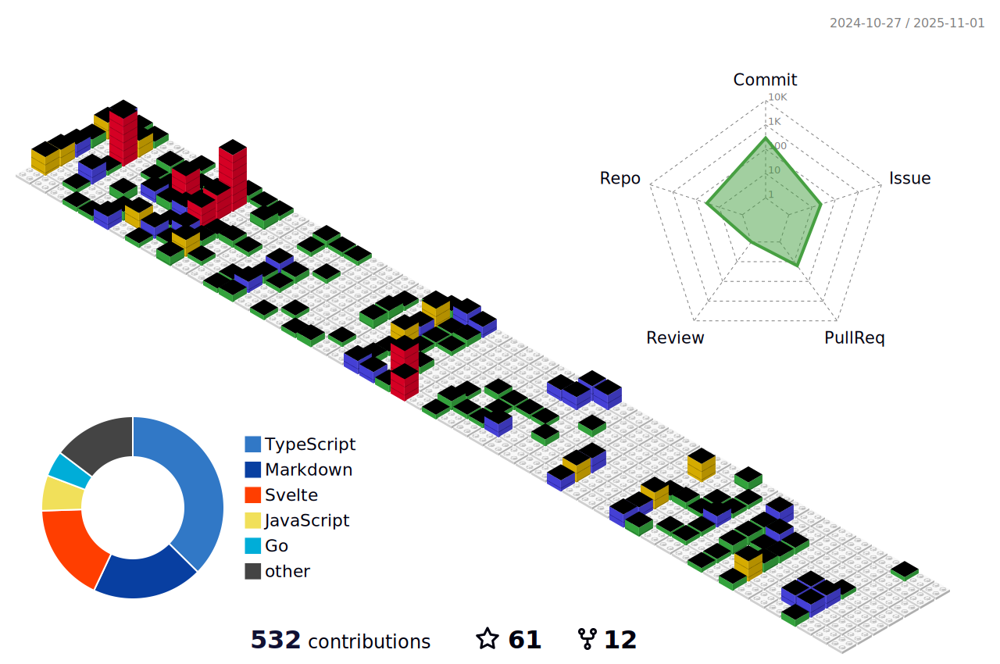

[](https://holopin.io/@guri)

<!----------------------------------------------------------------ABOUT ME ----------------------------------------------------->

## Hey Everyone👋

I am a skilled MERN Stack Developer with a passion for innovative design and a strong drive to join a creative, problem-solving team. Possessing the ability to learn and implement new technologies quickly, I am always looking to expand my skillset. As an open-source enthusiast, I have helped over 300+ students understand the importance of open-source and am currently in my Last year of **BCA** studies. 
As a **Full Stack Intern at NullClass**, Co-Founder of [Medictry](https://www.linkedin.com/company/89489745), I am dedicated to exploring new technologies and sharing my knowledge with others, making me a valuable asset to any team.

<p align="center">
    <a href = "mailto: gurjeetsinghvirdee@gmail.com" target="_blank"></a>
 </p>
 
<div align="center">
    
</div>


<div>


       <ul align="left">
            <li> 🏢 Co-Founder at <a href="https://www.linkedin.com/company/medictry/">MedicTry</a>
            <li> 💻 Mod at <a href="https://gssoc.girlscript.tech/"> GirlScript Summer of Code'23 </a></li>
            <li> 🧑‍💻 <strong>8</strong> PRs Merged at Hactoberfest'22 </li>
            <li> 💻 Contributor & Project Admin at <strong>HSOC'22</strong> </li>
            <li> 🎉 Secured <strong>10th</strong> Rank Globally in <strong>GSSoC'22</strong> </li>
            <li> 🏫 Currently learning NEXT JS </li>
            <li> 🤝 Collaborator at <a href="https://github.com/Rayman-Sodhi/Clone-IT"> Clone-IT </a> & <a href="https://github.com/utkarsh006/Eazy-Android"> Eazy-Android </a>
            </li>
            <li> 💬 Ask me about Anything </li>
            <li> 📕 Read My Articles at 
                <a href="https://auth.geeksforgeeks.org/user/gurjeetsinghvirdee/articles" target="_blank">@GeeksforGeeks</a>
            </li>
       </ul>  
</div>

<!--------------------------- Lanyard Profile--------------------------------->

<div align="center">        
    <a href="https://discord.com/users/916597112882495510"></a>
</div>

        
<!------------------------------------------TESTIMONIALS----------------------------------------------->
        
## ✨ Testimonials
        
<table>
  <tr>
    <th>Author</th>
    <th>Description</th>
  </tr>
  <tr>
    <td>Utkarsh Saxena</td>
    <td>I have worked with Gurjeet on a project and he has been very kind to me. Since I am from the Android domain he explained the web concepts to me in an easy way. He is also the collaborator of my Two Repos : Leetcode Grind and Eazy Android and is always kind to the new contributors and helps them to do their best. Looking forward to working with him more and enhancing this journey of Tech and Open Source.</td>
  </tr>
  <tr>
      <td>Ishika Goyal</td>
      <td>Gurjeet Singh Virdee is inspiring , good mentor, adviser and understanding friend. He continuously helping me in learning the open source contribution. I     truly appreciate everything he have done for me so far and hope to continue learning from him.</td>
  </tr>
</table>


<!-------------------------------------------------WAKA TIME---------------------------------------------------->

## 📊 Weekly Development Breakdown
  
<!--START_SECTION:waka-->

```txt
From: 27 July 2021 - To: 02 October 2023

Total Time: 333 hrs 59 mins

JavaScript       127 hrs 5 mins  █████████▓░░░░░░░░░░░░░░░   38.05 %
Markdown         62 hrs 10 mins  ████▓░░░░░░░░░░░░░░░░░░░░   18.61 %
HTML             50 hrs 27 mins  ███▓░░░░░░░░░░░░░░░░░░░░░   15.11 %
CSS              40 hrs 6 mins   ███░░░░░░░░░░░░░░░░░░░░░░   12.01 %
JSON             27 hrs 22 mins  ██░░░░░░░░░░░░░░░░░░░░░░░   08.20 %
```

<!--END_SECTION:waka--> 

<!---------------------------------Frameworks, Languages & Other Tools ------------------------------------->        
        
## ⚛️ Frameworks, Languages & Other Tools        
 
<p align="left"> 
    <a href="https://getbootstrap.com" target="_blank" rel="noreferrer">  
    </a> 
    <a href="https://www.w3schools.com/css/" target="_blank" rel="noreferrer">  
    </a> 
    <a href="https://expressjs.com" target="_blank" rel="noreferrer">  
    </a> 
    <a href="https://www.figma.com/" target="_blank" rel="noreferrer">  
    </a> <a href="https://firebase.google.com/" target="_blank" rel="noreferrer">  
    </a> 
    <a href="https://git-scm.com/" target="_blank" rel="noreferrer">  
    </a> 
    <a href="https://www.w3.org/html/" target="_blank" rel="noreferrer">  
    </a> 
    <a href="https://developer.mozilla.org/en-US/docs/Web/JavaScript" target="_blank" rel="noreferrer">  
    </a> 
    <a href="https://www.mongodb.com/" target="_blank" rel="noreferrer">  
    </a> 
    <a href="https://www.mysql.com/" target="_blank" rel="noreferrer">  
    </a> 
    <a href="https://nextjs.org/" target="_blank" rel="noreferrer">  
    </a> 
    <a href="https://nodejs.org" target="_blank" rel="noreferrer">  
    </a> 
    <a href="https://postman.com" target="_blank" rel="noreferrer">  
    </a> 
    <a href="https://reactjs.org/" target="_blank" rel="noreferrer">  
    </a> 
    <a href="https://redux.js.org" target="_blank" rel="noreferrer">  
    </a> 
    <a href="https://sass-lang.com" target="_blank" rel="noreferrer">  
    </a> 
    <a href="https://www.typescriptlang.org/" target="_blank" rel="noreferrer">  
    </a> 
    <a href="https://www.adobe.com/products/xd.html" target="_blank" rel="noreferrer">  
    </a> 
</p>

<!---------------------- OPEN SOURCE CONTRIBUTIONS ---------------------->
        
<details>
    <summary><h3> 👨‍💻 OPEN SOURCE CONTRIBUTIONS</h3></summary>  
    
|S.No.|Open Source Program |Duration| Contribution |Role|Rewards|
|---------|--------|-------|-------|----|-----|    
| 1. | GirlScript Summer Of Code 2022 | 1st Mar - 31st May 2022 | [Click Here](https://docs.google.com/document/d/15t_iThcyiNgIuAUmTJ9Utjy1ccxwTGZXy_0n8VYsHLE/edit?usp=sharing) | Contributor | [Link](https://drive.google.com/drive/folders/1gYYFepBLm09uATAZ9_Nh34opop_0nfCi?usp=sharing) |    
| 2. | GirlScript Summer Of Code 2022 | 1st Mar - 31st May 2022 | [Bundli-Frontend](https://github.com/Ayush7614/Bundli-Frontend) & [WebDev-ProjectKart](https://github.com/khushi-purwar/WebDev-ProjectKart) | Mentor | [Link](https://drive.google.com/drive/folders/1d0gDnPh8gR8qU61g-fWLEhahhshR8PXh?usp=sharing) |
| 3. | GirlScript Summer Of Code 2022 | 1st Mar - 31st July 2022 | Discord Moderator, Managing participants <br> activity through out the program. | Technical Team | T-Shirt [Link](https://drive.google.com/drive/folders/1B2jDXyXA-L-XXypvaNzrpXRTVY7GW-04?usp=sharing) |
| 4. | Hack Club RAIT | 1st July - 30st September 2022 | [Click Here](https://docs.google.com/document/d/1_ZutQmDbGkuFsbypF2oX_jbmFMf7OV-X4kr8xVs5J0w) | Contributor | [Link](https://drive.google.com/file/d/1Km6kXQU3NWr8OkWnaHB7-vLfEjhffplE/view?usp=sharing) |
| 5. | Hacktoberfest | 1st October - 31st October 2022 | [Click Here](https://docs.google.com/document/d/1mv27yGR7-SsIDOinqsYDnFutXHG49awhzvZYaEna3rM) | Contributor | T-Shirt & Stickers | 
| 6. | HyperEdge WOB'23 | 1st Feb - 1st May | Discord Moderator, Managing Leaderboard | Managing Team | - |
| 7. | GirlScript Summer Of Code 2023 | 6th May - 03 July | Jarvis - Decentralised Expense Tracker, GameZone | Mentor | - |
| 8. | GirlScript Summer Of Code 2023 | 29 May  - 5 September 2023 | Managing the activity of PA, Mentors & Contributors throughout the program | Discord Mod | - |
    
</details>

<!------------------------------------------------------------ GITHUB STATS ------------------------------------------------------------------------>
        
## 💫 Github Stats

<table>    
<tr>
  <td align="center">
    
  </td>
  <td align="center">
    
  </td>
</tr>
</table>

<div align="center">
     
</div>

<table>    
<tr>
  <td align="center">
    
  </td>
  <td align="center">
     
  </td>
</tr>
</table>

<div align="center">
  
</div>
        
### ⚡ Recent Activity     
        
<!--START_SECTION:activity-->  
`[10/03 23:31]`  Made `3` commits in [gurjeetsinghvirdee/eth-fund](https://github.com/gurjeetsinghvirdee/eth-fund)  
`[10/03 21:12]`  Made `61` commits in [gurjeetsinghvirdee/Badges4-README.md-Profile](https://github.com/gurjeetsinghvirdee/Badges4-README.md-Profile)  
`[10/03 21:09]`  Made `2` commits in [gurjeetsinghvirdee/gurjeetsinghvirdee](https://github.com/gurjeetsinghvirdee/gurjeetsinghvirdee)  
`[10/03 20:38]`  Made `1` commit in [gurjeetsinghvirdee/eth-fund](https://github.com/gurjeetsinghvirdee/eth-fund)  
`[10/03 17:04]`  Made `7` commits in [gurjeetsinghvirdee/React-Aura](https://github.com/gurjeetsinghvirdee/React-Aura)  

<details><summary><b> ⚙️ Show Older Activity</b></summary>

`[10/03 08:51]`  Commented on [`#13`](https://github.com//pooranjoyb/React-Aura/issues/13 'Sidebar Component created') in [pooranjoyb/React-Aura](https://github.com/pooranjoyb/React-Aura)  
`[10/03 07:55]`  Commented on [`#13`](https://github.com//pooranjoyb/React-Aura/issues/13 'Sidebar Component created') in [pooranjoyb/React-Aura](https://github.com/pooranjoyb/React-Aura)  
`[10/03 07:55]`  Made `1` commit in [gurjeetsinghvirdee/React-Aura](https://github.com/gurjeetsinghvirdee/React-Aura)  
`[10/03 07:47]`  Reviewed [`#13`](https://github.com//pooranjoyb/React-Aura/pull/13 'Sidebar Component created') in [pooranjoyb/React-Aura](https://github.com/pooranjoyb/React-Aura)  
`[10/03 07:46]`  Made `1` commit in [gurjeetsinghvirdee/React-Aura](https://github.com/gurjeetsinghvirdee/React-Aura)  
`[10/03 05:51]`  Reviewed [`#13`](https://github.com//pooranjoyb/React-Aura/pull/13 'Sidebar Component created') in [pooranjoyb/React-Aura](https://github.com/pooranjoyb/React-Aura)  
`[10/03 05:51]`  Made `1` commit in [gurjeetsinghvirdee/React-Aura](https://github.com/gurjeetsinghvirdee/React-Aura)  
`[10/03 05:49]`  Reviewed [`#13`](https://github.com//pooranjoyb/React-Aura/pull/13 'Sidebar Component created') in [pooranjoyb/React-Aura](https://github.com/pooranjoyb/React-Aura)  
`[10/03 05:45]`  Reviewed [`#13`](https://github.com//pooranjoyb/React-Aura/pull/13 'Sidebar Component created') in [pooranjoyb/React-Aura](https://github.com/pooranjoyb/React-Aura)  
`[10/03 05:32]`  Opened PR [`#13`](https://github.com//pooranjoyb/React-Aura/pull/13 'Sidebar Component created') in [pooranjoyb/React-Aura](https://github.com/pooranjoyb/React-Aura)  
`[10/03 05:29]`  Made `2` commits in [gurjeetsinghvirdee/React-Aura](https://github.com/gurjeetsinghvirdee/React-Aura)  
`[10/02 22:52]`  Commented on [`#12`](https://github.com//pooranjoyb/React-Aura/issues/12 'Want to create a Cards Component Page') in [pooranjoyb/React-Aura](https://github.com/pooranjoyb/React-Aura)  
`[10/02 22:43]`  Created branch [`gurjeetsinghvirdee`](https://github.com/gurjeetsinghvirdee/React-Aura/tree/gurjeetsinghvirdee) in [gurjeetsinghvirdee/React-Aura](https://github.com/gurjeetsinghvirdee/React-Aura)  
`[10/02 18:51]`  Commented on [`#12`](https://github.com//pooranjoyb/React-Aura/issues/12 'Want to create a Cards Component Page') in [pooranjoyb/React-Aura](https://github.com/pooranjoyb/React-Aura)  
`[10/02 18:46]`  Made `1` commit in [gurjeetsinghvirdee/React-Aura](https://github.com/gurjeetsinghvirdee/React-Aura)  
`[10/02 18:44]`  Opened issue [`#12`](https://github.com//pooranjoyb/React-Aura/issues/12 'Want to create a Cards Component Page') in [pooranjoyb/React-Aura](https://github.com/pooranjoyb/React-Aura)  
`[10/02 17:39]`  Forked [pooranjoyb/React-Aura](https://github.com/pooranjoyb/React-Aura) to [gurjeetsinghvirdee/React-Aura](https://github.com/gurjeetsinghvirdee/React-Aura)  
`[10/02 17:39]`  Opened issue [`#11`](https://github.com//pooranjoyb/React-Aura/issues/11 'Want to add custom Flip Card ') in [pooranjoyb/React-Aura](https://github.com/pooranjoyb/React-Aura)  
`[09/29 00:09]`  Made `3` commits in [gurjeetsinghvirdee/eth-fund](https://github.com/gurjeetsinghvirdee/eth-fund)  
`[09/28 23:38]`  Commented on [`#2`](https://github.com//gurjeetsinghvirdee/eth-fund/issues/2 'double check that the address and chainId are correct.') in [gurjeetsinghvirdee/eth-fund](https://github.com/gurjeetsinghvirdee/eth-fund)  
`[09/28 23:19]`  Opened issue [`#2`](https://github.com//gurjeetsinghvirdee/eth-fund/issues/2 'double check that the address and chainId are correct.') in [gurjeetsinghvirdee/eth-fund](https://github.com/gurjeetsinghvirdee/eth-fund)  
`[09/28 23:15]`  Commented on [`#1`](https://github.com//gurjeetsinghvirdee/eth-fund/issues/1 'function createCampaign ') in [gurjeetsinghvirdee/eth-fund](https://github.com/gurjeetsinghvirdee/eth-fund)  
`[09/28 23:12]`  Opened issue [`#1`](https://github.com//gurjeetsinghvirdee/eth-fund/issues/1 'function createCampaign ') in [gurjeetsinghvirdee/eth-fund](https://github.com/gurjeetsinghvirdee/eth-fund)  
`[09/28 23:08]`  Made `3` commits in [gurjeetsinghvirdee/eth-fund](https://github.com/gurjeetsinghvirdee/eth-fund)  
`[09/28 08:17]`  Starred [leonardomso/33-js-concepts](https://github.com/leonardomso/33-js-concepts)  
`[09/28 08:13]`  Starred [TheAlgorithms/JavaScript](https://github.com/TheAlgorithms/JavaScript)  
`[09/26 18:46]`  Made `5` commits in [gurjeetsinghvirdee/web3-crowdfunding](https://github.com/gurjeetsinghvirdee/web3-crowdfunding)  
`[09/23 18:32]`  Starred [utkarsh006/WeTweets](https://github.com/utkarsh006/WeTweets)  
`[09/22 21:44]`  Made `2` commits in [gurjeetsinghvirdee/web3-crowdfunding](https://github.com/gurjeetsinghvirdee/web3-crowdfunding)  
`[09/22 17:26]`  Made `2` commits in [girlscript/gssoc-website-new](https://github.com/girlscript/gssoc-website-new)  
`[09/21 00:14]`  Made `2` commits in [gurjeetsinghvirdee/web3-crowdfunding](https://github.com/gurjeetsinghvirdee/web3-crowdfunding)  
`[09/19 22:16]`  Made `2` commits in [gurjeetsinghvirdee/gssoc-website-new](https://github.com/gurjeetsinghvirdee/gssoc-website-new)  
`[09/19 22:15]`  Made `1` commit in [girlscript/gssoc-website-new](https://github.com/girlscript/gssoc-website-new)  
`[09/19 22:05]`  Made `18` commits in [gurjeetsinghvirdee/web3-crowdfunding](https://github.com/gurjeetsinghvirdee/web3-crowdfunding)  
`[09/17 18:59]`  Forked [DopplerHQ/awesome-interview-questions](https://github.com/DopplerHQ/awesome-interview-questions) to [gurjeetsinghvirdee/awesome-interview-questions](https://github.com/gurjeetsinghvirdee/awesome-interview-questions)  
`[09/17 18:57]`  Starred [DopplerHQ/awesome-interview-questions](https://github.com/DopplerHQ/awesome-interview-questions)  
`[09/17 18:57]`  Starred [sudheerj/javascript-interview-questions](https://github.com/sudheerj/javascript-interview-questions)  
`[09/17 18:28]`  Created branch [`master`](https://github.com/gurjeetsinghvirdee/web3-crowdfunding/tree/master) in [gurjeetsinghvirdee/web3-crowdfunding](https://github.com/gurjeetsinghvirdee/web3-crowdfunding)  
`[09/17 18:27]`  Created repository [gurjeetsinghvirdee/web3-crowdfunding](https://github.com/gurjeetsinghvirdee/web3-crowdfunding)  
`[09/17 18:18]`  Created repository [gurjeetsinghvirdee/web3-crowdfunding-platform](https://github.com/gurjeetsinghvirdee/web3-crowdfunding-platform)  
`[09/17 18:12]`  Created branch [`master`](https://github.com/gurjeetsinghvirdee/crowdfunding-platform/tree/master) in [gurjeetsinghvirdee/crowdfunding-platform](https://github.com/gurjeetsinghvirdee/crowdfunding-platform)  
`[09/17 17:32]`  Created repository [gurjeetsinghvirdee/crowdfunding-platform](https://github.com/gurjeetsinghvirdee/crowdfunding-platform)  
`[09/17 17:31]`  Created branch [`main`](https://github.com/gurjeetsinghvirdee/crowdfunding-platform/tree/main) in [gurjeetsinghvirdee/crowdfunding-platform](https://github.com/gurjeetsinghvirdee/crowdfunding-platform)  
`[09/17 17:30]`  Created repository [gurjeetsinghvirdee/crowdfunding-platform](https://github.com/gurjeetsinghvirdee/crowdfunding-platform)  
`[09/17 11:44]`  Made `3` commits in [gurjeetsinghvirdee/gssoc-website-new](https://github.com/gurjeetsinghvirdee/gssoc-website-new)  
`[09/17 11:39]`  Made `2` commits in [girlscript/gssoc-website-new](https://github.com/girlscript/gssoc-website-new)  
`[09/16 18:08]`  Made `1` commit in [gurjeetsinghvirdee/gssoc-website-new](https://github.com/gurjeetsinghvirdee/gssoc-website-new)  
`[09/16 17:57]`  Made `1` commit in [girlscript/gssoc-website-new](https://github.com/girlscript/gssoc-website-new)  
`[09/11 17:31]`  Made `1` commit in [gurjeetsinghvirdee/gssoc-website-new](https://github.com/gurjeetsinghvirdee/gssoc-website-new)  
`[09/11 17:25]`  Made `2` commits in [girlscript/gssoc-website-new](https://github.com/girlscript/gssoc-website-new)  
`[09/11 17:25]`  Merged PR [`#160`](https://github.com//girlscript/gssoc-website-new/pull/160 'Update email') in [girlscript/gssoc-website-new](https://github.com/girlscript/gssoc-website-new)  
`[09/11 17:25]`  Opened PR [`#160`](https://github.com//girlscript/gssoc-website-new/pull/160 'Update email') in [girlscript/gssoc-website-new](https://github.com/girlscript/gssoc-website-new)  
`[09/11 17:25]`  Made `2` commits in [gurjeetsinghvirdee/gssoc-website-new](https://github.com/gurjeetsinghvirdee/gssoc-website-new)  
`[09/11 16:34]`  Made `1` commit in [girlscript/gssoc-website-new](https://github.com/girlscript/gssoc-website-new)  
`[09/10 20:28]`  Starred [vasanthk/react-bits](https://github.com/vasanthk/react-bits)  
`[09/10 19:57]`  Starred [nodejs/node](https://github.com/nodejs/node)  
`[09/10 05:32]`  Made `2` commits in [gurjeetsinghvirdee/learning-threeJS](https://github.com/gurjeetsinghvirdee/learning-threeJS)  
`[09/10 05:32]`  Merged PR [`#2`](https://github.com//gurjeetsinghvirdee/learning-threeJS/pull/2 '[ImgBot] Optimize images') in [gurjeetsinghvirdee/learning-threeJS](https://github.com/gurjeetsinghvirdee/learning-threeJS)  
`[09/09 21:19]`  Deleted `imgbot` from [gurjeetsinghvirdee/learning-threeJS](https://github.com/gurjeetsinghvirdee/learning-threeJS)  
`[09/09 21:19]`  Closed PR [`#1`](https://github.com//gurjeetsinghvirdee/learning-threeJS/pull/1 '[ImgBot] Optimize images') in [gurjeetsinghvirdee/learning-threeJS](https://github.com/gurjeetsinghvirdee/learning-threeJS)  
`[09/09 21:17]`  Made `11` commits in [gurjeetsinghvirdee/learning-threeJS](https://github.com/gurjeetsinghvirdee/learning-threeJS)  
`[09/09 17:43]`  Created branch [`master`](https://github.com/gurjeetsinghvirdee/learning-threeJS/tree/master) in [gurjeetsinghvirdee/learning-threeJS](https://github.com/gurjeetsinghvirdee/learning-threeJS)  
`[09/09 17:36]`  Created repository [gurjeetsinghvirdee/learning-threeJS](https://github.com/gurjeetsinghvirdee/learning-threeJS)  
`[09/09 17:34]`  Made `2` commits in [gurjeetsinghvirdee/starting-with-threejs](https://github.com/gurjeetsinghvirdee/starting-with-threejs)  
`[09/09 17:18]`  Created branch [`master`](https://github.com/gurjeetsinghvirdee/starting-with-threejs/tree/master) in [gurjeetsinghvirdee/starting-with-threejs](https://github.com/gurjeetsinghvirdee/starting-with-threejs)  
`[09/09 17:17]`  Created repository [gurjeetsinghvirdee/starting-with-threejs](https://github.com/gurjeetsinghvirdee/starting-with-threejs)  
`[09/09 17:12]`  Starred [floating-ui/floating-ui](https://github.com/floating-ui/floating-ui)  
`[09/07 19:30]`  Made `40` commits in [gurjeetsinghvirdee/khugitshii](https://github.com/gurjeetsinghvirdee/khugitshii)  
`[09/07 13:34]`  Made `6` commits in [gurjeetsinghvirdee/gssoc-website-new](https://github.com/gurjeetsinghvirdee/gssoc-website-new)  
`[09/07 08:54]`  Made `2` commits in [girlscript/gssoc-website-new](https://github.com/girlscript/gssoc-website-new)  
`[09/06 09:45]`  Made `1` commit in [gurjeetsinghvirdee/gurjeetsinghvirdee](https://github.com/gurjeetsinghvirdee/gurjeetsinghvirdee)  
`[09/06 09:08]`  Made `1` commit in [gurjeetsinghvirdee/gssoc-website-new](https://github.com/gurjeetsinghvirdee/gssoc-website-new)  
`[09/06 07:37]`  Made `1` commit in [girlscript/gssoc-website-new](https://github.com/girlscript/gssoc-website-new)  
`[09/05 13:06]`  Made `3` commits in [gurjeetsinghvirdee/gssoc-website-new](https://github.com/gurjeetsinghvirdee/gssoc-website-new)  
`[09/05 13:06]`  Made `3` commits in [girlscript/gssoc-website-new](https://github.com/girlscript/gssoc-website-new)  
`[09/04 16:56]`  Made `1` commit in [gurjeetsinghvirdee/gssoc-website-new](https://github.com/gurjeetsinghvirdee/gssoc-website-new)  
`[09/04 16:53]`  Made `2` commits in [girlscript/gssoc-website-new](https://github.com/girlscript/gssoc-website-new)  
`[09/04 16:53]`  Merged PR [`#159`](https://github.com//girlscript/gssoc-website-new/pull/159 'all emails added') in [girlscript/gssoc-website-new](https://github.com/girlscript/gssoc-website-new)  
`[09/04 16:52]`  Opened PR [`#159`](https://github.com//girlscript/gssoc-website-new/pull/159 'all emails added') in [girlscript/gssoc-website-new](https://github.com/girlscript/gssoc-website-new)  
`[09/04 16:50]`  Made `2` commits in [gurjeetsinghvirdee/gssoc-website-new](https://github.com/gurjeetsinghvirdee/gssoc-website-new)  
`[09/02 19:57]`  Made `1` commit in [girlscript/gssoc-website-new](https://github.com/girlscript/gssoc-website-new)  
`[09/02 17:10]`  Made `1` commit in [gurjeetsinghvirdee/gssoc-website-new](https://github.com/gurjeetsinghvirdee/gssoc-website-new)  
`[09/02 17:09]`  Made `2` commits in [girlscript/gssoc-website-new](https://github.com/girlscript/gssoc-website-new)  
`[09/02 17:09]`  Merged PR [`#158`](https://github.com//girlscript/gssoc-website-new/pull/158 'few mails added in mentors json') in [girlscript/gssoc-website-new](https://github.com/girlscript/gssoc-website-new)  
`[09/02 17:09]`  Opened PR [`#158`](https://github.com//girlscript/gssoc-website-new/pull/158 'few mails added in mentors json') in [girlscript/gssoc-website-new](https://github.com/girlscript/gssoc-website-new)  
`[09/02 17:09]`  Made `6` commits in [gurjeetsinghvirdee/gssoc-website-new](https://github.com/gurjeetsinghvirdee/gssoc-website-new)  
`[09/01 19:19]`  Made `5` commits in [girlscript/gssoc-website-new](https://github.com/girlscript/gssoc-website-new)  
`[08/31 19:37]`  Made `1` commit in [gurjeetsinghvirdee/gssoc-website-new](https://github.com/gurjeetsinghvirdee/gssoc-website-new)  
`[08/31 19:27]`  Made `2` commits in [girlscript/gssoc-website-new](https://github.com/girlscript/gssoc-website-new)  
`[08/31 19:27]`  Merged PR [`#157`](https://github.com//girlscript/gssoc-website-new/pull/157 'Admins data updated') in [girlscript/gssoc-website-new](https://github.com/girlscript/gssoc-website-new)  
`[08/31 19:26]`  Opened PR [`#157`](https://github.com//girlscript/gssoc-website-new/pull/157 'Admins data updated') in [girlscript/gssoc-website-new](https://github.com/girlscript/gssoc-website-new)  
`[08/31 19:24]`  Made `4` commits in [gurjeetsinghvirdee/gssoc-website-new](https://github.com/gurjeetsinghvirdee/gssoc-website-new)  
`[08/31 18:58]`  Made `3` commits in [girlscript/gssoc-website-new](https://github.com/girlscript/gssoc-website-new)  
`[08/31 18:46]`  Merged PR [`#156`](https://github.com//girlscript/gssoc-website-new/pull/156 'lower Case Email issue fixed') in [girlscript/gssoc-website-new](https://github.com/girlscript/gssoc-website-new)  
`[08/31 18:44]`  Opened PR [`#156`](https://github.com//girlscript/gssoc-website-new/pull/156 'lower Case Email issue fixed') in [girlscript/gssoc-website-new](https://github.com/girlscript/gssoc-website-new)  
`[08/31 18:44]`  Created branch [`Admins-data`](https://github.com/gurjeetsinghvirdee/gssoc-website-new/tree/Admins-data) in [gurjeetsinghvirdee/gssoc-website-new](https://github.com/gurjeetsinghvirdee/gssoc-website-new)  
`[08/31 16:20]`  Made `4` commits in [gurjeetsinghvirdee/gssoc-website-new](https://github.com/gurjeetsinghvirdee/gssoc-website-new)  
`[08/30 14:57]`  Made `2` commits in [girlscript/gssoc-website-new](https://github.com/girlscript/gssoc-website-new)  
`[08/30 14:57]`  Merged PR [`#155`](https://github.com//girlscript/gssoc-website-new/pull/155 'top contributors emails added') in [girlscript/gssoc-website-new](https://github.com/girlscript/gssoc-website-new)  
`[08/30 14:57]`  Opened PR [`#155`](https://github.com//girlscript/gssoc-website-new/pull/155 'top contributors emails added') in [girlscript/gssoc-website-new](https://github.com/girlscript/gssoc-website-new)  
`[08/30 14:56]`  Made `3` commits in [gurjeetsinghvirdee/gssoc-website-new](https://github.com/gurjeetsinghvirdee/gssoc-website-new)  
`[08/30 12:02]`  Merged PR [`#154`](https://github.com//girlscript/gssoc-website-new/pull/154 'data has been merged from other json file') in [girlscript/gssoc-website-new](https://github.com/girlscript/gssoc-website-new)  
`[08/30 12:02]`  Made `2` commits in [girlscript/gssoc-website-new](https://github.com/girlscript/gssoc-website-new)  
`[08/30 12:02]`  Opened PR [`#154`](https://github.com//girlscript/gssoc-website-new/pull/154 'data has been merged from other json file') in [girlscript/gssoc-website-new](https://github.com/girlscript/gssoc-website-new)  
`[08/30 12:01]`  Made `8` commits in [gurjeetsinghvirdee/gssoc-website-new](https://github.com/gurjeetsinghvirdee/gssoc-website-new)  
`[08/30 11:47]`  Made `2` commits in [girlscript/gssoc-website-new](https://github.com/girlscript/gssoc-website-new)  
`[08/30 11:47]`  Merged PR [`#152`](https://github.com//girlscript/gssoc-website-new/pull/152 'Added Contributers 200-300 json') in [girlscript/gssoc-website-new](https://github.com/girlscript/gssoc-website-new)  
`[08/30 11:46]`  Made `3` commits in [girlscript/gssoc-website-new](https://github.com/girlscript/gssoc-website-new)  
`[08/30 11:46]`  Merged PR [`#153`](https://github.com//girlscript/gssoc-website-new/pull/153 'Contributors data ') in [girlscript/gssoc-website-new](https://github.com/girlscript/gssoc-website-new)  
`[08/30 11:45]`  Opened PR [`#153`](https://github.com//girlscript/gssoc-website-new/pull/153 'Contributors data ') in [girlscript/gssoc-website-new](https://github.com/girlscript/gssoc-website-new)  
`[08/30 11:45]`  Made `1` commit in [gurjeetsinghvirdee/gssoc-website-new](https://github.com/gurjeetsinghvirdee/gssoc-website-new)  
`[08/30 10:42]`  Created branch [`contributors_data`](https://github.com/gurjeetsinghvirdee/gssoc-website-new/tree/contributors_data) in [gurjeetsinghvirdee/gssoc-website-new](https://github.com/gurjeetsinghvirdee/gssoc-website-new)  
`[08/30 10:31]`  Made `2` commits in [gurjeetsinghvirdee/gssoc-website-new](https://github.com/gurjeetsinghvirdee/gssoc-website-new)  
`[08/30 10:21]`  Reviewed [`#152`](https://github.com//girlscript/gssoc-website-new/pull/152 'Added Contributers 200-300 json') in [girlscript/gssoc-website-new](https://github.com/girlscript/gssoc-website-new)  
`[08/29 19:13]`  Made `2` commits in [gurjeetsinghvirdee/gssoc-website-new](https://github.com/gurjeetsinghvirdee/gssoc-website-new)  
`[08/29 19:09]`  Made `3` commits in [girlscript/gssoc-website-new](https://github.com/girlscript/gssoc-website-new)  
`[08/29 19:08]`  Merged PR [`#151`](https://github.com//girlscript/gssoc-website-new/pull/151 'Top100 contributors data has been added') in [girlscript/gssoc-website-new](https://github.com/girlscript/gssoc-website-new)  
`[08/29 19:08]`  Opened PR [`#151`](https://github.com//girlscript/gssoc-website-new/pull/151 'Top100 contributors data has been added') in [girlscript/gssoc-website-new](https://github.com/girlscript/gssoc-website-new)  
`[08/29 19:07]`  Made `2` commits in [gurjeetsinghvirdee/gssoc-website-new](https://github.com/gurjeetsinghvirdee/gssoc-website-new)  
`[08/29 16:42]`  Merged PR [`#150`](https://github.com//girlscript/gssoc-website-new/pull/150 'typo error fixed & added some data') in [girlscript/gssoc-website-new](https://github.com/girlscript/gssoc-website-new)  
`[08/29 16:42]`  Made `2` commits in [girlscript/gssoc-website-new](https://github.com/girlscript/gssoc-website-new)  
`[08/29 16:41]`  Opened PR [`#150`](https://github.com//girlscript/gssoc-website-new/pull/150 'typo error fixed & added some data') in [girlscript/gssoc-website-new](https://github.com/girlscript/gssoc-website-new)  
`[08/29 16:40]`  Made `5` commits in [gurjeetsinghvirdee/gssoc-website-new](https://github.com/gurjeetsinghvirdee/gssoc-website-new)  
`[08/21 23:28]`  Made `2` commits in [gurjeetsinghvirdee/apple-vision-pro-clone](https://github.com/gurjeetsinghvirdee/apple-vision-pro-clone)  
`[08/18 22:35]`  Made `2` commits in [gurjeetsinghvirdee/gurjeetsinghvirdee](https://github.com/gurjeetsinghvirdee/gurjeetsinghvirdee)  
`[08/18 22:23]`  Made `13` commits in [gurjeetsinghvirdee/apple-vision-pro-clone](https://github.com/gurjeetsinghvirdee/apple-vision-pro-clone)  
`[08/15 19:01]`  Made `1` commit in [gurjeetsinghvirdee/gssoc-website-new](https://github.com/gurjeetsinghvirdee/gssoc-website-new)  
`[08/15 18:55]`  Made `1` commit in [girlscript/gssoc-website-new](https://github.com/girlscript/gssoc-website-new)  
`[08/15 16:00]`  Commented on [`#2850`](https://github.com//kunjgit/GameZone/issues/2850 '[GSSoC\'23] HueHero Game added') in [kunjgit/GameZone](https://github.com/kunjgit/GameZone)  
`[08/15 13:53]`  Made `3` commits in [gurjeetsinghvirdee/gssoc-website-new](https://github.com/gurjeetsinghvirdee/gssoc-website-new)  
`[08/12 14:29]`  Made `2` commits in [girlscript/gssoc-website-new](https://github.com/girlscript/gssoc-website-new)  
`[08/12 14:29]`  Merged PR [`#147`](https://github.com//girlscript/gssoc-website-new/pull/147 '[2023] Final Leaderboard') in [girlscript/gssoc-website-new](https://github.com/girlscript/gssoc-website-new)  
`[08/12 14:28]`  Reviewed [`#147`](https://github.com//girlscript/gssoc-website-new/pull/147 '[2023] Final Leaderboard') in [girlscript/gssoc-website-new](https://github.com/girlscript/gssoc-website-new)  
`[08/11 07:59]`  Made `4` commits in [gurjeetsinghvirdee/gssoc-website-new](https://github.com/gurjeetsinghvirdee/gssoc-website-new)  
`[08/11 07:52]`  Made `3` commits in [girlscript/gssoc-website-new](https://github.com/girlscript/gssoc-website-new)  
`[08/11 07:52]`  Merged PR [`#146`](https://github.com//girlscript/gssoc-website-new/pull/146 'Fetching PRs from json file ') in [girlscript/gssoc-website-new](https://github.com/girlscript/gssoc-website-new)  
`[08/11 07:52]`  Opened PR [`#146`](https://github.com//girlscript/gssoc-website-new/pull/146 'Fetching PRs from json file ') in [girlscript/gssoc-website-new](https://github.com/girlscript/gssoc-website-new)  
`[08/11 07:51]`  Made `1` commit in [gurjeetsinghvirdee/gssoc-website-new](https://github.com/gurjeetsinghvirdee/gssoc-website-new)  
`[08/11 07:45]`  Created branch [`api`](https://github.com/gurjeetsinghvirdee/gssoc-website-new/tree/api) in [gurjeetsinghvirdee/gssoc-website-new](https://github.com/gurjeetsinghvirdee/gssoc-website-new)  
`[08/11 07:32]`  Made `1` commit in [gurjeetsinghvirdee/gssoc-website-new](https://github.com/gurjeetsinghvirdee/gssoc-website-new)  
`[08/11 07:32]`  Made `1` commit in [girlscript/gssoc-website-new](https://github.com/girlscript/gssoc-website-new)  
`[08/09 15:59]`  Closed issue [`#2852`](https://github.com//kunjgit/GameZone/issues/2852 '[New game]: card Game') in [kunjgit/GameZone](https://github.com/kunjgit/GameZone)  
`[08/09 15:55]`  Commented on [`#2856`](https://github.com//kunjgit/GameZone/issues/2856 'Game Addition') in [kunjgit/GameZone](https://github.com/kunjgit/GameZone)  
`[08/09 15:52]`  Closed issue [`#2854`](https://github.com//kunjgit/GameZone/issues/2854 '[New game]: mine-sweeper game') in [kunjgit/GameZone](https://github.com/kunjgit/GameZone)  
`[08/09 15:52]`  Merged PR [`#2855`](https://github.com//kunjgit/GameZone/pull/2855 'my mine sweeper game is added') in [kunjgit/GameZone](https://github.com/kunjgit/GameZone)  
`[08/09 15:52]`  Made `2` commits in [kunjgit/GameZone](https://github.com/kunjgit/GameZone)  
`[08/09 15:46]`  Reviewed [`#2855`](https://github.com//kunjgit/GameZone/pull/2855 'my mine sweeper game is added') in [kunjgit/GameZone](https://github.com/kunjgit/GameZone)  
`[08/09 15:41]`  Commented on [`#2856`](https://github.com//kunjgit/GameZone/issues/2856 'Game Addition') in [kunjgit/GameZone](https://github.com/kunjgit/GameZone)  
`[08/09 15:24]`  Closed PR [`#2856`](https://github.com//kunjgit/GameZone/pull/2856 'Game Addition') in [kunjgit/GameZone](https://github.com/kunjgit/GameZone)  
`[08/09 15:23]`  Reviewed [`#2856`](https://github.com//kunjgit/GameZone/pull/2856 'Game Addition') in [kunjgit/GameZone](https://github.com/kunjgit/GameZone)  
`[08/09 14:41]`  Made `4` commits in [gurjeetsinghvirdee/gssoc-website-new](https://github.com/gurjeetsinghvirdee/gssoc-website-new)  
`[08/09 13:17]`  Made `3` commits in [kunjgit/GameZone](https://github.com/kunjgit/GameZone)  
`[08/09 13:17]`  Merged PR [`#2833`](https://github.com//kunjgit/GameZone/pull/2833 'Added a new game called Crossy Road') in [kunjgit/GameZone](https://github.com/kunjgit/GameZone)  
`[08/09 13:17]`  Closed issue [`#2824`](https://github.com//kunjgit/GameZone/issues/2824 '[New game]: Crossy Road') in [kunjgit/GameZone](https://github.com/kunjgit/GameZone)  
`[08/09 11:26]`  Closed issue [`#2842`](https://github.com//kunjgit/GameZone/issues/2842 '[New game]: Test your brain') in [kunjgit/GameZone](https://github.com/kunjgit/GameZone)  
`[08/09 11:26]`  Made `3` commits in [kunjgit/GameZone](https://github.com/kunjgit/GameZone)  
`[08/09 11:26]`  Merged PR [`#2843`](https://github.com//kunjgit/GameZone/pull/2843 'TEST YOUR BRAIN GAME IS ADDED') in [kunjgit/GameZone](https://github.com/kunjgit/GameZone)  
`[08/09 11:25]`  Reviewed [`#2843`](https://github.com//kunjgit/GameZone/pull/2843 'TEST YOUR BRAIN GAME IS ADDED') in [kunjgit/GameZone](https://github.com/kunjgit/GameZone)  
`[08/09 11:08]`  Made `1` commit in [girlscript/gssoc-website-new](https://github.com/girlscript/gssoc-website-new)  
`[08/09 10:56]`  Closed issue [`#2838`](https://github.com//kunjgit/GameZone/issues/2838 '[Enhancement]: MENJA game is not playable ') in [kunjgit/GameZone](https://github.com/kunjgit/GameZone)  
`[08/09 10:56]`  Made `2` commits in [kunjgit/GameZone](https://github.com/kunjgit/GameZone)  
`[08/09 10:56]`  Merged PR [`#2841`](https://github.com//kunjgit/GameZone/pull/2841 'Resolved issue related to MENJA game') in [kunjgit/GameZone](https://github.com/kunjgit/GameZone)  
`[08/09 10:56]`  Reviewed [`#2841`](https://github.com//kunjgit/GameZone/pull/2841 'Resolved issue related to MENJA game') in [kunjgit/GameZone](https://github.com/kunjgit/GameZone)  
`[08/09 10:55]`  Closed issue [`#2830`](https://github.com//kunjgit/GameZone/issues/2830 '[New game]: Candy Match Saga') in [kunjgit/GameZone](https://github.com/kunjgit/GameZone)  
`[08/09 10:55]`  Made `3` commits in [kunjgit/GameZone](https://github.com/kunjgit/GameZone)  
`[08/09 10:55]`  Merged PR [`#2846`](https://github.com//kunjgit/GameZone/pull/2846 'Added Candy match saga game') in [kunjgit/GameZone](https://github.com/kunjgit/GameZone)  
`[08/09 10:54]`  Reviewed [`#2846`](https://github.com//kunjgit/GameZone/pull/2846 'Added Candy match saga game') in [kunjgit/GameZone](https://github.com/kunjgit/GameZone)  
`[08/09 09:19]`  Made `1` commit in [girlscript/gssoc-website-new](https://github.com/girlscript/gssoc-website-new)  
`[08/09 07:28]`  Commented on [`#2507`](https://github.com//pranjay-poddar/Dev-Geeks/issues/2507 'Improve the UI of the deployed website') in [pranjay-poddar/Dev-Geeks](https://github.com/pranjay-poddar/Dev-Geeks)  
`[08/09 07:11]`  Commented on [`#2507`](https://github.com//pranjay-poddar/Dev-Geeks/issues/2507 'Improve the UI of the deployed website') in [pranjay-poddar/Dev-Geeks](https://github.com/pranjay-poddar/Dev-Geeks)  
`[08/09 06:11]`  Made `2` commits in [kunjgit/GameZone](https://github.com/kunjgit/GameZone)  
`[08/09 06:11]`  Merged PR [`#2832`](https://github.com//kunjgit/GameZone/pull/2832 'Resolving hover effect on gihub') in [kunjgit/GameZone](https://github.com/kunjgit/GameZone)  
`[08/09 06:11]`  Reviewed [`#2832`](https://github.com//kunjgit/GameZone/pull/2832 'Resolving hover effect on gihub') in [kunjgit/GameZone](https://github.com/kunjgit/GameZone)  
`[08/09 06:10]`  Made `7` commits in [kunjgit/GameZone](https://github.com/kunjgit/GameZone)  
`[08/09 06:10]`  Closed issue [`#2834`](https://github.com//kunjgit/GameZone/issues/2834 '[New game]: Numeral Whiz') in [kunjgit/GameZone](https://github.com/kunjgit/GameZone)  
`[08/09 06:10]`  Merged PR [`#2835`](https://github.com//kunjgit/GameZone/pull/2835 'added Numeral-Whiz') in [kunjgit/GameZone](https://github.com/kunjgit/GameZone)  

</details>
<!--END_SECTION:activity-->

<!--------------------------------------------- 3D Contribution Graph -------------------------------------------->




       
<!---------------------------------------------- Some More Stats ------------------------------------------------->       
       
<details>
  <summary> <b> ❤️ Github Followers </b> </summary>
    
</details>   

<details>
  <summary> <b> 💻 Github Terminal </b> </summary>
    
</details>

<details>
  <summary> <b> 📆 Github Contribution Calendar </b></summary>
    
</details>


