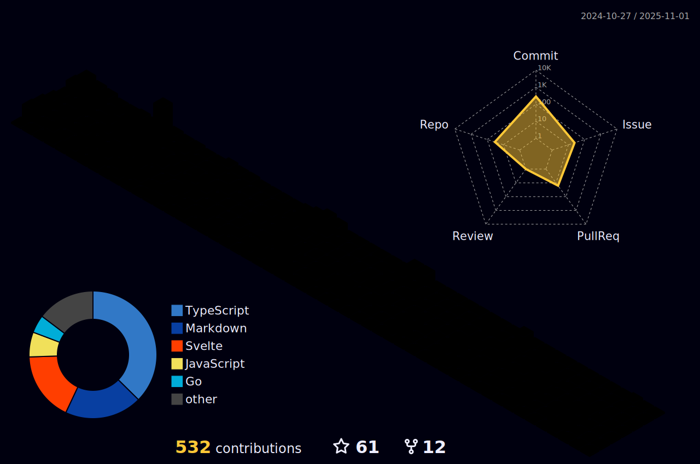

[](https://holopin.io/@guri)

<!----------------------------------------------------------------ABOUT ME ----------------------------------------------------->

## Hey Everyone👋

I am a skilled MERN Stack Developer with a passion for innovative design and a strong drive to join a creative, problem-solving team. Possessing the ability to learn and implement new technologies quickly, I am always looking to expand my skillset. As an open-source enthusiast, I have helped over 200 students understand the importance of open-source and am currently in my 2nd year of **BCA** studies. 
As a **Full Stack Intern at NullClass**, Co-Founder of [Medictry](https://www.linkedin.com/company/89489745), I am dedicated to exploring new technologies and sharing my knowledge with others, making me a valuable asset to any team.

<p align="center">
    <a href = "mailto: gurjeetsinghvirdee@gmail.com" target="_blank"></a>
 </p>
 
<div align="center">
    
</div>


<div>


       <ul align="left">
            <li> 🏢 Co-Founder at <a href="https://www.linkedin.com/company/medictry/">MedicTry</a>
            <li> 💻 Managing Team at <a href="https://hyperedge.so/"> HyperEdge WOB'23 </a></li>
            <li> 🧑‍💻 <strong>8</strong> PRs Merged at Hactoberfest'22 </li>
            <li> 💻 Contributor & Project Admin at <strong>HSOC'22</strong> </li>
            <li> 🎉 Secured <strong>10th</strong> Rank Globally in <strong>GSSoC'22</strong> </li>
            <li> 🏫 Currently learning NEXT JS </li>
            <li> 🤝 Collaborator at <a href="https://github.com/Rayman-Sodhi/Clone-IT"> Clone-IT </a> & <a href="https://github.com/utkarsh006/Eazy-Android"> Eazy-Android </a>
            </li>
            <li> 💬 Ask me about Anything </li>
            <li> 📕 Read My Articles at 
                <a href="https://auth.geeksforgeeks.org/user/gurjeetsinghvirdee/articles" target="_blank">@GeeksforGeeks</a>
            </li>
       </ul>  
</div>

<!--------------------------- Lanyard Profile--------------------------------->

<div align="center">        
    <a href="https://discord.com/users/916597112882495510"></a>
</div>
        
<!------------------------------------------TESTIMONIALS----------------------------------------------->
        
## ✨ Testimonials
        
<table>
  <tr>
    <th>Author</th>
    <th>Title</th>
    <th>Description</th>
  </tr>
  <tr>
    <td><a target="_blank" href="https://www.linkedin.com/in/utkarsh06/">Utkarsh Saxena</a></td>
    <td>Amazing Helper and teacher</td>
    <td>I have worked with Gurjeet on a project and he has been very kind to me. Since I am from the Android domain he explained the web concepts to me in an easy way. He is also the collaborator of my Two Repos : Leetcode Grind and Eazy Android and is always kind to the new contributors and helps them to do their best. Looking forward to working with him more and enhancing this journey of Tech and Open Source.</td>
  </tr>
  <tr>
      <td><a target="_blank" href="https://www.linkedin.com/in/ishika-goyal-375112221/">Ishika Goyal</a></td>
      <td>Good Mentor</td>
      <td>Gurjeet Singh Virdee is inspiring , good mentor, adviser and understanding friend. He continuously helping me in learning the open source contribution. I     truly appreciate everything he have done for me so far and hope to continue learning from him.</td>
  </tr>
</table>

## 📊 Weekly Development Breakdown
  
<!--START_SECTION:waka-->

```text
From: 27 July 2021 - To: 27 February 2023

Total Time: 227 hrs 54 mins

JavaScript       67 hrs 1 min    ███████▒░░░░░░░░░░░░░░░░░   29.41 %
Markdown         53 hrs 6 mins   █████▓░░░░░░░░░░░░░░░░░░░   23.30 %
HTML             43 hrs 7 mins   ████▓░░░░░░░░░░░░░░░░░░░░   18.92 %
CSS              32 hrs 43 mins  ███▓░░░░░░░░░░░░░░░░░░░░░   14.36 %
JSON             12 hrs 28 mins  █▒░░░░░░░░░░░░░░░░░░░░░░░   05.47 %
TypeScript       3 hrs 7 mins    ▒░░░░░░░░░░░░░░░░░░░░░░░░   01.37 %
```

<!--END_SECTION:waka--> 

<!---------------------- OPEN SOURCE CONTRIBUTIONS ---------------------->
        
<details>
    <summary><h3> 👨‍💻 OPEN SOURCE CONTRIBUTIONS</h3></summary>  
    
|S.No.|Open Source Program |Duration| Contribution |Role|Rewards|
|---------|--------|-------|-------|----|-----|    
| 1. | GirlScript Summer Of Code | 1st Mar - 31st May 2022 | [Click Here](https://docs.google.com/document/d/15t_iThcyiNgIuAUmTJ9Utjy1ccxwTGZXy_0n8VYsHLE/edit?usp=sharing) | Contributor | [Link](https://drive.google.com/drive/folders/1gYYFepBLm09uATAZ9_Nh34opop_0nfCi?usp=sharing) |    
| 2. | GirlScript Summer Of Code | 1st Mar - 31st May 2022 | [Bundli-Frontend](https://github.com/Ayush7614/Bundli-Frontend) & [WebDev-ProjectKart](https://github.com/khushi-purwar/WebDev-ProjectKart) | Mentor | [Link](https://drive.google.com/drive/folders/1d0gDnPh8gR8qU61g-fWLEhahhshR8PXh?usp=sharing) |
| 3. | GirlScript Summer Of Code | 1st Mar - 31st July 2022 | Discord Moderator | Technical Team | T-Shirt [Link](https://drive.google.com/drive/folders/1B2jDXyXA-L-XXypvaNzrpXRTVY7GW-04?usp=sharing) |
| 4. | Hack Club RAIT | 1st July - 30st September 2022 | [Click Here](https://docs.google.com/document/d/1_ZutQmDbGkuFsbypF2oX_jbmFMf7OV-X4kr8xVs5J0w) | Contributor | [Link](https://drive.google.com/file/d/1Km6kXQU3NWr8OkWnaHB7-vLfEjhffplE/view?usp=sharing) |
| 5. | Hacktoberfest | 1st October - 31st October 2022 | [Click Here](https://docs.google.com/document/d/1mv27yGR7-SsIDOinqsYDnFutXHG49awhzvZYaEna3rM) | Contributor | T-Shirt & Stickers | 
| 6. | HyperEdge WOB'23 | 1st Feb - Present | Discord Moderator, | Managing Team | - | 
    
</details>

<!---------------------------------Frameworks, Languages & Other Tools ------------------------------------->        
        
## ⚛️ Frameworks, Languages & Other Tools        
 
<div align="center">
         
        
        
        
        
        
        
        
        
        
        
        
          
        
        
        
        
        
        
        
        
        
        
        
        
        
</div>

<!------------------------------------------------------------ GITHUB STATS ------------------------------------------------------------------------>
        
## 💫 Github Stats
        
<table>
<tr>
  <td align="center">
     
  </td>  
  <td align="center"> 
    
  </td>  
</tr>    
<tr>
  <td align="center">
    
  </td>
  <td align="center">
     
  </td>
</tr>
</table>

<div align="center">
  
</div>
        
### ⚡ Recent Activity     
        
<!--START_SECTION:activity-->  
`[02/16 08:47]`  Made `3` commits in [gurjeetsinghvirdee/gurjeetsinghvirdee](https://github.com/gurjeetsinghvirdee/gurjeetsinghvirdee)  
`[02/14 09:12]`  Made `2` commits in [gurjeetsinghvirdee/angular](https://github.com/gurjeetsinghvirdee/angular)  
`[02/14 09:12]`  Merged PR [`#5`](https://github.com//gurjeetsinghvirdee/angular/pull/5 'Bump http-cache-semantics from 4.1.0 to 4.1.1') in [gurjeetsinghvirdee/angular](https://github.com/gurjeetsinghvirdee/angular)  
`[02/14 08:32]`  Made `2` commits in [gurjeetsinghvirdee/gurjeetsinghvirdee](https://github.com/gurjeetsinghvirdee/gurjeetsinghvirdee)  
`[02/12 16:09]`  Made `38` commits in [gurjeetsinghvirdee/Badges4-README.md-Profile](https://github.com/gurjeetsinghvirdee/Badges4-README.md-Profile)  

<details><summary><b> ⚙️ Show Older Activity</b></summary>

`[02/12 16:05]`  Made `3` commits in [gurjeetsinghvirdee/gurjeetsinghvirdee](https://github.com/gurjeetsinghvirdee/gurjeetsinghvirdee)  
`[02/10 16:15]`  Made `32` commits in [gurjeetsinghvirdee/portfolio](https://github.com/gurjeetsinghvirdee/portfolio)  
`[02/05 18:49]`  Starred [cnrad/lanyard-profile-readme](https://github.com/cnrad/lanyard-profile-readme)  
`[02/05 18:42]`  Made `3` commits in [gurjeetsinghvirdee/gurjeetsinghvirdee](https://github.com/gurjeetsinghvirdee/gurjeetsinghvirdee)  
`[02/04 19:02]`  Made `2` commits in [gurjeetsinghvirdee/CodeClause_Unit_Converter](https://github.com/gurjeetsinghvirdee/CodeClause_Unit_Converter)  
`[02/04 18:54]`  Made `6` commits in [gurjeetsinghvirdee/CodeClause](https://github.com/gurjeetsinghvirdee/CodeClause)  
`[02/04 16:43]`  Created branch [`master`](https://github.com/gurjeetsinghvirdee/CodeClause/tree/master) in [gurjeetsinghvirdee/CodeClause](https://github.com/gurjeetsinghvirdee/CodeClause)  
`[02/03 16:37]`  Created repository [gurjeetsinghvirdee/CodeClause](https://github.com/gurjeetsinghvirdee/CodeClause)  
`[02/01 22:23]`  Made `7` commits in [gurjeetsinghvirdee/gurjeetsinghvirdee](https://github.com/gurjeetsinghvirdee/gurjeetsinghvirdee)  
`[02/01 20:43]`  Made `28` commits in [gurjeetsinghvirdee/Embellish](https://github.com/gurjeetsinghvirdee/Embellish)  
`[02/01 20:40]`  Made `112` commits in [gurjeetsinghvirdee/LinkFree](https://github.com/gurjeetsinghvirdee/LinkFree)  
`[02/01 20:11]`  Made `12` commits in [gurjeetsinghvirdee/LGMVIP-Web](https://github.com/gurjeetsinghvirdee/LGMVIP-Web)  
`[02/01 16:50]`  Created branch [`master`](https://github.com/gurjeetsinghvirdee/LGMVIP-Web/tree/master) in [gurjeetsinghvirdee/LGMVIP-Web](https://github.com/gurjeetsinghvirdee/LGMVIP-Web)  
`[02/01 16:47]`  Created repository [gurjeetsinghvirdee/LGMVIP-Web](https://github.com/gurjeetsinghvirdee/LGMVIP-Web)  
`[01/30 20:36]`  Made `8` commits in [gurjeetsinghvirdee/gurjeetsinghvirdee](https://github.com/gurjeetsinghvirdee/gurjeetsinghvirdee)  
`[01/29 19:42]`  Made `27` commits in [gurjeetsinghvirdee/LinkFree](https://github.com/gurjeetsinghvirdee/LinkFree)  
`[01/29 19:42]`  Merged PR [`#1`](https://github.com//gurjeetsinghvirdee/LinkFree/pull/1 '[ImgBot] Optimize images') in [gurjeetsinghvirdee/LinkFree](https://github.com/gurjeetsinghvirdee/LinkFree)  
`[01/29 19:41]`  Made `20` commits in [gurjeetsinghvirdee/LinkFree](https://github.com/gurjeetsinghvirdee/LinkFree)  
`[01/29 17:00]`  Closed issue [`#1`](https://github.com//torco34/mi-portafolio/issues/1 'bug') in [torco34/mi-portafolio](https://github.com/torco34/mi-portafolio)  
`[01/29 09:56]`  Made `5` commits in [gurjeetsinghvirdee/LinkFree](https://github.com/gurjeetsinghvirdee/LinkFree)  
`[01/29 09:16]`  Made `1` commit in [gurjeetsinghvirdee/gurjeetsinghvirdee](https://github.com/gurjeetsinghvirdee/gurjeetsinghvirdee)  
`[01/29 08:55]`  Opened PR [`#4201`](https://github.com//EddieHubCommunity/LinkFree/pull/4201 'data: update gurjeetsinghvirdee') in [EddieHubCommunity/LinkFree](https://github.com/EddieHubCommunity/LinkFree)  
`[01/29 08:54]`  Created branch [`testimonials`](https://github.com/gurjeetsinghvirdee/LinkFree/tree/testimonials) in [gurjeetsinghvirdee/LinkFree](https://github.com/gurjeetsinghvirdee/LinkFree)  
`[01/29 08:49]`  Forked [EddieHubCommunity/LinkFree](https://github.com/EddieHubCommunity/LinkFree) to [gurjeetsinghvirdee/LinkFree](https://github.com/gurjeetsinghvirdee/LinkFree)  
`[01/29 08:48]`  Closed PR [`#4198`](https://github.com//EddieHubCommunity/LinkFree/pull/4198 'data: update gurjeetsinghvirdee') in [EddieHubCommunity/LinkFree](https://github.com/EddieHubCommunity/LinkFree)  
`[01/29 08:13]`  Opened PR [`#4198`](https://github.com//EddieHubCommunity/LinkFree/pull/4198 'testimonial updated') in [EddieHubCommunity/LinkFree](https://github.com/EddieHubCommunity/LinkFree)  
`[01/29 08:11]`  Made `1` commit in [gurjeetsinghvirdee/LinkFree](https://github.com/gurjeetsinghvirdee/LinkFree)  
`[01/29 08:06]`  Created branch [`patch-1`](https://github.com/gurjeetsinghvirdee/LinkFree/tree/patch-1) in [gurjeetsinghvirdee/LinkFree](https://github.com/gurjeetsinghvirdee/LinkFree)  
`[01/29 08:06]`  Made `1` commit in [gurjeetsinghvirdee/LinkFree](https://github.com/gurjeetsinghvirdee/LinkFree)  
`[01/29 08:06]`  Forked [EddieHubCommunity/LinkFree](https://github.com/EddieHubCommunity/LinkFree) to [gurjeetsinghvirdee/LinkFree](https://github.com/gurjeetsinghvirdee/LinkFree)  
`[01/29 07:56]`  Made `170` commits in [gurjeetsinghvirdee/LinkFree](https://github.com/gurjeetsinghvirdee/LinkFree)  
`[01/28 22:04]`  Made `38` commits in [gurjeetsinghvirdee/Embellish](https://github.com/gurjeetsinghvirdee/Embellish)  
`[01/28 21:59]`  Made `3` commits in [gurjeetsinghvirdee/Google-Clone](https://github.com/gurjeetsinghvirdee/Google-Clone)  
`[01/28 17:32]`  Opened issue [`#1`](https://github.com//torco34/mi-portafolio/issues/1 'bug') in [torco34/mi-portafolio](https://github.com/torco34/mi-portafolio)  
`[01/28 16:40]`  Made `6` commits in [gurjeetsinghvirdee/Eazy-Android](https://github.com/gurjeetsinghvirdee/Eazy-Android)  
`[01/28 08:17]`  Closed issue [`#498`](https://github.com//TusharAMD/Runn/issues/498 'Whac a mole') in [TusharAMD/Runn](https://github.com/TusharAMD/Runn)  
`[01/28 08:17]`  Closed issue [`#499`](https://github.com//TusharAMD/Runn/issues/499 'Pacman game') in [TusharAMD/Runn](https://github.com/TusharAMD/Runn)  
`[01/28 08:17]`  Closed issue [`#501`](https://github.com//TusharAMD/Runn/issues/501 'Fidget ') in [TusharAMD/Runn](https://github.com/TusharAMD/Runn)  
`[01/28 08:17]`  Closed issue [`#497`](https://github.com//TusharAMD/Runn/issues/497 'Memory Game ') in [TusharAMD/Runn](https://github.com/TusharAMD/Runn)  
`[01/28 08:17]`  Closed issue [`#496`](https://github.com//TusharAMD/Runn/issues/496 'Frogger') in [TusharAMD/Runn](https://github.com/TusharAMD/Runn)  
`[01/28 08:16]`  Closed issue [`#495`](https://github.com//TusharAMD/Runn/issues/495 'Breakout Game') in [TusharAMD/Runn](https://github.com/TusharAMD/Runn)  
`[01/28 08:16]`  Closed issue [`#125`](https://github.com//TusharAMD/Runn/issues/125 'Rock Paper Scissors') in [TusharAMD/Runn](https://github.com/TusharAMD/Runn)  
`[01/28 08:16]`  Closed issue [`#500`](https://github.com//TusharAMD/Runn/issues/500 'Sokoban game') in [TusharAMD/Runn](https://github.com/TusharAMD/Runn)  
`[01/28 06:37]`  Made `2` commits in [gurjeetsinghvirdee/angular](https://github.com/gurjeetsinghvirdee/angular)  
`[01/28 06:37]`  Merged PR [`#4`](https://github.com//gurjeetsinghvirdee/angular/pull/4 'Bump ua-parser-js from 0.7.31 to 0.7.33') in [gurjeetsinghvirdee/angular](https://github.com/gurjeetsinghvirdee/angular)  
`[01/27 22:21]`  Made `1` commit in [gurjeetsinghvirdee/WebDev-ProjectKart](https://github.com/gurjeetsinghvirdee/WebDev-ProjectKart)  
`[01/27 20:49]`  Made `8` commits in [gurjeetsinghvirdee/gurjeetsinghvirdee](https://github.com/gurjeetsinghvirdee/gurjeetsinghvirdee)  
`[01/27 05:31]`  Made `112` commits in [gurjeetsinghvirdee/how-to-contribute-to-open-source](https://github.com/gurjeetsinghvirdee/how-to-contribute-to-open-source)  
`[01/26 22:22]`  Made `5` commits in [gurjeetsinghvirdee/gurjeetsinghvirdee](https://github.com/gurjeetsinghvirdee/gurjeetsinghvirdee)  
`[01/26 22:07]`  Reviewed [`#7`](https://github.com//gurjeetsinghvirdee/gurjeetsinghvirdee/pull/7 'updating all PRS') in [gurjeetsinghvirdee/gurjeetsinghvirdee](https://github.com/gurjeetsinghvirdee/gurjeetsinghvirdee)  
`[01/26 22:07]`  Reviewed [`#7`](https://github.com//gurjeetsinghvirdee/gurjeetsinghvirdee/pull/7 'updating all PRS') in [gurjeetsinghvirdee/gurjeetsinghvirdee](https://github.com/gurjeetsinghvirdee/gurjeetsinghvirdee)  
`[01/26 22:06]`  Made `5` commits in [gurjeetsinghvirdee/gurjeetsinghvirdee](https://github.com/gurjeetsinghvirdee/gurjeetsinghvirdee)  
`[01/26 21:20]`  Made `1` commit in [gurjeetsinghvirdee/github-activity-readme](https://github.com/gurjeetsinghvirdee/github-activity-readme)  
`[01/26 21:15]`  Forked [jamesgeorge007/github-activity-readme](https://github.com/jamesgeorge007/github-activity-readme) to [gurjeetsinghvirdee/github-activity-readme](https://github.com/gurjeetsinghvirdee/github-activity-readme)  
`[01/26 21:09]`  Made `11` commits in [gurjeetsinghvirdee/gurjeetsinghvirdee](https://github.com/gurjeetsinghvirdee/gurjeetsinghvirdee)  
`[01/26 10:44]`  Made `7` commits in [gurjeetsinghvirdee/LinkFree](https://github.com/gurjeetsinghvirdee/LinkFree)  
`[01/26 10:43]`  Created branch [`patch-01`](https://github.com/gurjeetsinghvirdee/LinkFree/tree/patch-01) in [gurjeetsinghvirdee/LinkFree](https://github.com/gurjeetsinghvirdee/LinkFree)  
`[01/26 08:53]`  Made `1912` commits in [gurjeetsinghvirdee/LinkFree](https://github.com/gurjeetsinghvirdee/LinkFree)  
`[01/25 16:13]`  Starred [storybookjs/storybook](https://github.com/storybookjs/storybook)  
`[01/25 16:07]`  Opened PR [`#3972`](https://github.com//EddieHubCommunity/LinkFree/pull/3972 'data: gurjeetsinghvirdee') in [EddieHubCommunity/LinkFree](https://github.com/EddieHubCommunity/LinkFree)  
`[01/25 16:06]`  Made `563` commits in [gurjeetsinghvirdee/LinkFree](https://github.com/gurjeetsinghvirdee/LinkFree)  
`[01/25 09:24]`  Commented on [`#3950`](https://github.com//EddieHubCommunity/LinkFree/issues/3950 'Fix social media preview of LinkFree profile') in [EddieHubCommunity/LinkFree](https://github.com/EddieHubCommunity/LinkFree)  
`[01/25 09:06]`  Commented on [`#3950`](https://github.com//EddieHubCommunity/LinkFree/issues/3950 'Fix social media preview of LinkFree profile') in [EddieHubCommunity/LinkFree](https://github.com/EddieHubCommunity/LinkFree)  
`[01/25 09:02]`  Commented on [`#3950`](https://github.com//EddieHubCommunity/LinkFree/issues/3950 'Fix social media preview of LinkFree profile') in [EddieHubCommunity/LinkFree](https://github.com/EddieHubCommunity/LinkFree)  
`[01/25 08:56]`  Commented on [`#3950`](https://github.com//EddieHubCommunity/LinkFree/issues/3950 'Fix social media preview of LinkFree profile') in [EddieHubCommunity/LinkFree](https://github.com/EddieHubCommunity/LinkFree)  
`[01/25 08:53]`  Commented on [`#3950`](https://github.com//EddieHubCommunity/LinkFree/issues/3950 'Fix social media preview of LinkFree profile') in [EddieHubCommunity/LinkFree](https://github.com/EddieHubCommunity/LinkFree)  
`[01/25 08:40]`  Commented on [`#3934`](https://github.com//EddieHubCommunity/LinkFree/issues/3934 'New Testimonial for Madhu Saini') in [EddieHubCommunity/LinkFree](https://github.com/EddieHubCommunity/LinkFree)  
`[01/24 07:33]`  Commented on [`#12`](https://github.com//parnexcodes/cinehub-nextjs/issues/12 'Error: getServerSideProps') in [parnexcodes/cinehub-nextjs](https://github.com/parnexcodes/cinehub-nextjs)  
`[01/24 06:48]`  Opened issue [`#12`](https://github.com//parnexcodes/cinehub-nextjs/issues/12 'Error: getServerSideProps') in [parnexcodes/cinehub-nextjs](https://github.com/parnexcodes/cinehub-nextjs)  
`[01/24 04:58]`  Starred [rahuldkjain/github-profile-readme-generator](https://github.com/rahuldkjain/github-profile-readme-generator)  
`[01/23 10:00]`  Made `1` commit in [gurjeetsinghvirdee/gurjeetsinghvirdee](https://github.com/gurjeetsinghvirdee/gurjeetsinghvirdee)  
`[01/23 09:59]`  Made `24` commits in [gurjeetsinghvirdee/website](https://github.com/gurjeetsinghvirdee/website)  
`[01/21 20:50]`  Forked [kubernetes/website](https://github.com/kubernetes/website) to [gurjeetsinghvirdee/website](https://github.com/gurjeetsinghvirdee/website)  
`[01/21 15:51]`  Made `2` commits in [utkarsh006/LeetCode-Grind](https://github.com/utkarsh006/LeetCode-Grind)  
`[01/17 19:11]`  Made `1` commit in [gurjeetsinghvirdee/Clone-IT](https://github.com/gurjeetsinghvirdee/Clone-IT)  
`[01/17 19:09]`  Made `3` commits in [Rayman-Sodhi/Clone-IT](https://github.com/Rayman-Sodhi/Clone-IT)  
`[01/17 19:09]`  Merged PR [`#714`](https://github.com//Rayman-Sodhi/Clone-IT/pull/714 'Open Source Programs section typos fixed') in [Rayman-Sodhi/Clone-IT](https://github.com/Rayman-Sodhi/Clone-IT)  
`[01/17 19:08]`  Opened PR [`#714`](https://github.com//Rayman-Sodhi/Clone-IT/pull/714 'Open Source Programs section typos fixed') in [Rayman-Sodhi/Clone-IT](https://github.com/Rayman-Sodhi/Clone-IT)  
`[01/17 19:05]`  Made `6` commits in [gurjeetsinghvirdee/Clone-IT](https://github.com/gurjeetsinghvirdee/Clone-IT)  
`[01/17 17:04]`  Commented on [`#713`](https://github.com//Rayman-Sodhi/Clone-IT/issues/713 'Update README.md') in [Rayman-Sodhi/Clone-IT](https://github.com/Rayman-Sodhi/Clone-IT)  
`[01/17 17:03]`  Made `4` commits in [Rayman-Sodhi/Clone-IT](https://github.com/Rayman-Sodhi/Clone-IT)  
`[01/17 17:03]`  Merged PR [`#713`](https://github.com//Rayman-Sodhi/Clone-IT/pull/713 'Update README.md') in [Rayman-Sodhi/Clone-IT](https://github.com/Rayman-Sodhi/Clone-IT)  
`[01/17 17:03]`  Reviewed [`#713`](https://github.com//Rayman-Sodhi/Clone-IT/pull/713 'Update README.md') in [Rayman-Sodhi/Clone-IT](https://github.com/Rayman-Sodhi/Clone-IT)  
`[01/17 09:13]`  Reviewed [`#713`](https://github.com//Rayman-Sodhi/Clone-IT/pull/713 'Update README.md') in [Rayman-Sodhi/Clone-IT](https://github.com/Rayman-Sodhi/Clone-IT)  
`[01/16 16:55]`  Made `2` commits in [gurjeetsinghvirdee/gurjeetsinghvirdee](https://github.com/gurjeetsinghvirdee/gurjeetsinghvirdee)  
`[01/13 19:44]`  Opened issue [`#6463`](https://github.com//EddieHubCommunity/support/issues/6463 'Please add me to the EddieHub API') in [EddieHubCommunity/support](https://github.com/EddieHubCommunity/support)  
`[01/12 23:48]`  Made `3` commits in [gurjeetsinghvirdee/gurjeetsinghvirdee](https://github.com/gurjeetsinghvirdee/gurjeetsinghvirdee)  
`[01/12 23:48]`  Merged PR [`#14`](https://github.com//gurjeetsinghvirdee/gurjeetsinghvirdee/pull/14 '[ImgBot] Optimize images') in [gurjeetsinghvirdee/gurjeetsinghvirdee](https://github.com/gurjeetsinghvirdee/gurjeetsinghvirdee)  
`[01/12 23:47]`  Made `5` commits in [gurjeetsinghvirdee/gurjeetsinghvirdee](https://github.com/gurjeetsinghvirdee/gurjeetsinghvirdee)  
`[01/12 23:46]`  Reviewed [`#14`](https://github.com//gurjeetsinghvirdee/gurjeetsinghvirdee/pull/14 '[ImgBot] Optimize images') in [gurjeetsinghvirdee/gurjeetsinghvirdee](https://github.com/gurjeetsinghvirdee/gurjeetsinghvirdee)  
`[01/12 19:28]`  Made `2` commits in [gurjeetsinghvirdee/gurjeetsinghvirdee](https://github.com/gurjeetsinghvirdee/gurjeetsinghvirdee)  
`[01/12 19:28]`  Merged PR [`#13`](https://github.com//gurjeetsinghvirdee/gurjeetsinghvirdee/pull/13 '[ImgBot] Optimize images') in [gurjeetsinghvirdee/gurjeetsinghvirdee](https://github.com/gurjeetsinghvirdee/gurjeetsinghvirdee)  
`[01/12 19:28]`  Reviewed [`#13`](https://github.com//gurjeetsinghvirdee/gurjeetsinghvirdee/pull/13 '[ImgBot] Optimize images') in [gurjeetsinghvirdee/gurjeetsinghvirdee](https://github.com/gurjeetsinghvirdee/gurjeetsinghvirdee)  
`[01/12 19:22]`  Made `244` commits in [gurjeetsinghvirdee/LinkFree](https://github.com/gurjeetsinghvirdee/LinkFree)  
`[01/12 10:20]`  Made `2` commits in [gurjeetsinghvirdee/gurjeetsinghvirdee](https://github.com/gurjeetsinghvirdee/gurjeetsinghvirdee)  
`[01/12 10:20]`  Merged PR [`#12`](https://github.com//gurjeetsinghvirdee/gurjeetsinghvirdee/pull/12 '[ImgBot] Optimize images') in [gurjeetsinghvirdee/gurjeetsinghvirdee](https://github.com/gurjeetsinghvirdee/gurjeetsinghvirdee)  
`[01/12 09:42]`  Commented on [`#712`](https://github.com//Rayman-Sodhi/Clone-IT/issues/712 'Restructuring the structure of Repo') in [Rayman-Sodhi/Clone-IT](https://github.com/Rayman-Sodhi/Clone-IT)  
`[01/11 21:43]`  Made `65` commits in [gurjeetsinghvirdee/Eazy-Android](https://github.com/gurjeetsinghvirdee/Eazy-Android)  
`[01/11 21:27]`  Made `7` commits in [gurjeetsinghvirdee/Social-page](https://github.com/gurjeetsinghvirdee/Social-page)  
`[01/11 19:53]`  Merged PR [`#1`](https://github.com//gurjeetsinghvirdee/Social-page/pull/1 '[ImgBot] Optimize images') in [gurjeetsinghvirdee/Social-page](https://github.com/gurjeetsinghvirdee/Social-page)  
`[01/11 19:18]`  Made `1` commit in [gurjeetsinghvirdee/Social-page](https://github.com/gurjeetsinghvirdee/Social-page)  
`[01/11 19:16]`  Created branch [`master`](https://github.com/gurjeetsinghvirdee/Social-page/tree/master) in [gurjeetsinghvirdee/Social-page](https://github.com/gurjeetsinghvirdee/Social-page)  
`[01/11 19:15]`  Created repository [gurjeetsinghvirdee/Social-page](https://github.com/gurjeetsinghvirdee/Social-page)  
`[01/11 07:40]`  Created branch [`imgbot`](https://github.com/gurjeetsinghvirdee/gurjeetsinghvirdee/tree/imgbot) in [gurjeetsinghvirdee/gurjeetsinghvirdee](https://github.com/gurjeetsinghvirdee/gurjeetsinghvirdee)  
`[01/11 07:40]`  Deleted `imgbot` from [gurjeetsinghvirdee/gurjeetsinghvirdee](https://github.com/gurjeetsinghvirdee/gurjeetsinghvirdee)  
`[01/11 07:40]`  Made `2` commits in [gurjeetsinghvirdee/gurjeetsinghvirdee](https://github.com/gurjeetsinghvirdee/gurjeetsinghvirdee)  
`[01/11 07:40]`  Merged PR [`#11`](https://github.com//gurjeetsinghvirdee/gurjeetsinghvirdee/pull/11 '[ImgBot] Optimize images') in [gurjeetsinghvirdee/gurjeetsinghvirdee](https://github.com/gurjeetsinghvirdee/gurjeetsinghvirdee)  
`[01/11 05:51]`  Made `75` commits in [gurjeetsinghvirdee/LinkFree](https://github.com/gurjeetsinghvirdee/LinkFree)  
`[01/10 22:07]`  Made `2` commits in [gurjeetsinghvirdee/gurjeetsinghvirdee](https://github.com/gurjeetsinghvirdee/gurjeetsinghvirdee)  
`[01/10 22:07]`  Merged PR [`#10`](https://github.com//gurjeetsinghvirdee/gurjeetsinghvirdee/pull/10 '[ImgBot] Optimize images') in [gurjeetsinghvirdee/gurjeetsinghvirdee](https://github.com/gurjeetsinghvirdee/gurjeetsinghvirdee)  
`[01/10 22:06]`  Made `21` commits in [gurjeetsinghvirdee/stackoverflow-clone](https://github.com/gurjeetsinghvirdee/stackoverflow-clone)  
`[01/10 09:32]`  Made `8` commits in [gurjeetsinghvirdee/LinkFree](https://github.com/gurjeetsinghvirdee/LinkFree)  
`[01/10 09:32]`  Reviewed [`#3052`](https://github.com//EddieHubCommunity/LinkFree/pull/3052 'data: gurjeetsinghvirdee') in [EddieHubCommunity/LinkFree](https://github.com/EddieHubCommunity/LinkFree)  
`[01/10 09:31]`  Made `2` commits in [gurjeetsinghvirdee/LinkFree](https://github.com/gurjeetsinghvirdee/LinkFree)  
`[01/10 09:10]`  Reviewed [`#3052`](https://github.com//EddieHubCommunity/LinkFree/pull/3052 'data: gurjeetsinghvirdee') in [EddieHubCommunity/LinkFree](https://github.com/EddieHubCommunity/LinkFree)  
`[01/10 09:08]`  Made `13` commits in [gurjeetsinghvirdee/LinkFree](https://github.com/gurjeetsinghvirdee/LinkFree)  
`[01/10 08:58]`  Opened PR [`#3052`](https://github.com//EddieHubCommunity/LinkFree/pull/3052 'data: gurjeetsinghvirdee') in [EddieHubCommunity/LinkFree](https://github.com/EddieHubCommunity/LinkFree)  
`[01/10 08:54]`  Made `14` commits in [gurjeetsinghvirdee/LinkFree](https://github.com/gurjeetsinghvirdee/LinkFree)  
`[01/10 08:44]`  Created branch [`patch-1`](https://github.com/gurjeetsinghvirdee/LinkFree/tree/patch-1) in [gurjeetsinghvirdee/LinkFree](https://github.com/gurjeetsinghvirdee/LinkFree)  
`[01/10 08:43]`  Made `72` commits in [gurjeetsinghvirdee/LinkFree](https://github.com/gurjeetsinghvirdee/LinkFree)  
`[01/10 08:19]`  Commented on [`#2967`](https://github.com//EddieHubCommunity/LinkFree/issues/2967 'New Testimonial for Gurjeet Singh Virdee') in [EddieHubCommunity/LinkFree](https://github.com/EddieHubCommunity/LinkFree)  
`[01/10 08:18]`  Commented on [`#3026`](https://github.com//EddieHubCommunity/LinkFree/issues/3026 'data utkarsh006.json') in [EddieHubCommunity/LinkFree](https://github.com/EddieHubCommunity/LinkFree)  
`[01/10 07:07]`  Commented on [`#2967`](https://github.com//EddieHubCommunity/LinkFree/issues/2967 'New Testimonial for Gurjeet Singh Virdee') in [EddieHubCommunity/LinkFree](https://github.com/EddieHubCommunity/LinkFree)  
`[01/10 07:02]`  Commented on [`#2967`](https://github.com//EddieHubCommunity/LinkFree/issues/2967 'New Testimonial for Gurjeet Singh Virdee') in [EddieHubCommunity/LinkFree](https://github.com/EddieHubCommunity/LinkFree)  
`[01/10 06:54]`  Made `2` commits in [gurjeetsinghvirdee/angular](https://github.com/gurjeetsinghvirdee/angular)  
`[01/10 06:54]`  Merged PR [`#3`](https://github.com//gurjeetsinghvirdee/angular/pull/3 'Bump json5 from 2.2.1 to 2.2.3') in [gurjeetsinghvirdee/angular](https://github.com/gurjeetsinghvirdee/angular)  
`[01/10 05:54]`  Made `2` commits in [gurjeetsinghvirdee/gurjeetsinghvirdee](https://github.com/gurjeetsinghvirdee/gurjeetsinghvirdee)  
`[01/10 05:54]`  Merged PR [`#9`](https://github.com//gurjeetsinghvirdee/gurjeetsinghvirdee/pull/9 '[ImgBot] Optimize images') in [gurjeetsinghvirdee/gurjeetsinghvirdee](https://github.com/gurjeetsinghvirdee/gurjeetsinghvirdee)  
`[01/09 23:54]`  Made `180` commits in [gurjeetsinghvirdee/LinkFree](https://github.com/gurjeetsinghvirdee/LinkFree)  
`[01/09 23:50]`  Made `3` commits in [gurjeetsinghvirdee/stackoverflow-clone](https://github.com/gurjeetsinghvirdee/stackoverflow-clone)  
`[01/09 23:47]`  Deleted `main` from [gurjeetsinghvirdee/stackoverflow-clone](https://github.com/gurjeetsinghvirdee/stackoverflow-clone)  
`[01/09 23:46]`  Created branch [`master`](https://github.com/gurjeetsinghvirdee/stackoverflow-clone/tree/master) in [gurjeetsinghvirdee/stackoverflow-clone](https://github.com/gurjeetsinghvirdee/stackoverflow-clone)  
`[01/09 22:55]`  Made `4` commits in [gurjeetsinghvirdee/gurjeetsinghvirdee](https://github.com/gurjeetsinghvirdee/gurjeetsinghvirdee)  
`[01/09 22:44]`  Deleted `output` from [gurjeetsinghvirdee/gurjeetsinghvirdee](https://github.com/gurjeetsinghvirdee/gurjeetsinghvirdee)  
`[01/09 22:44]`  Deleted `master` from [gurjeetsinghvirdee/gurjeetsinghvirdee](https://github.com/gurjeetsinghvirdee/gurjeetsinghvirdee)  
`[01/09 22:43]`  Deleted `imgbot` from [gurjeetsinghvirdee/gurjeetsinghvirdee](https://github.com/gurjeetsinghvirdee/gurjeetsinghvirdee)  
`[01/09 22:43]`  Made `4` commits in [gurjeetsinghvirdee/gurjeetsinghvirdee](https://github.com/gurjeetsinghvirdee/gurjeetsinghvirdee)  

</details>
<!--END_SECTION:activity-->

<!--------------------------------------------- 3D Contribution Graph -------------------------------------------->




       
<!---------------------------------------------- Some More Stats ------------------------------------------------->       
       
<details>
  <summary> <b> ❤️ Github Followers </b> </summary>
    
</details>   

<details>
  <summary> <b> 🦾 Github Achievements </b> </summary>
    
</details>

<details>
  <summary> <b> 📆 Github Contribution Calendar </b></summary>
    
</details>

<!----------------------------------------------- Buy Me A Coffee ------------------------------------------------>
        
<div align="center">
    <a href="https://www.buymeacoffee.com/gurjeetsingh" target="_blank">
    </a>
</div>

